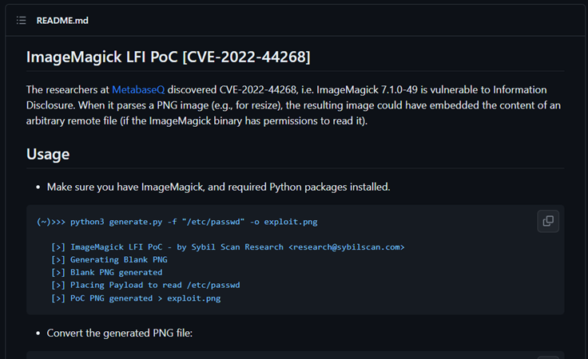
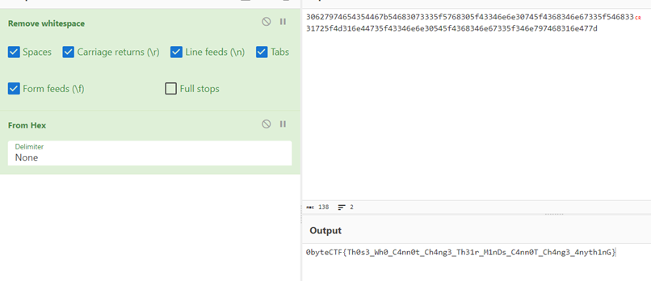

# Gambar Ajaib
> Aplikasi ini dirancang untuk memproses gambar dengan format tertentu, kemudian dapat disulap dengan sentuhan magis aplikasinya.

> Ada satu cerita tentang sejarah Indonesia yang disembunyikan, hal itu tersimpan dengan sangat rapih di /rahasia

> Coba check dulu!

## About the Challenge
A website is provided without the source code, where users can upload PNG image files on the site.


## How to Solve?
This site is vulnerable to CVE-2022-44268, which is an LFI (Local File Inclusion) vulnerability in ImageMagick version 7.1.0-49. This conclusion is drawn from the puzzle name `Gambar Ajaib` and the website's code year being 2022. To exploit this vulnerability, I used a GitHub repository where a tool can generate images containing payloads to read files on the server. Here is the GitHub repository I used: https://github.com/Sybil-Scan/imagemagick-lfi-poc



However, before proceeding with exploitation, I discovered a rather peculiar endpoint, namely `/rahasia` (which means `secret` in Indonesian). There's a possibility that this `/rahasia` endpoint is related to the challenge that is to be exploited.


So in this case, I will attempt to read the file named "/rahasia" by executing the following command:

```bash
python3 generate.py -f "/rahasia" -o exploit.png
```

Next, upload the generated image to the website and then re-download the uploaded image. Proceed with the following shell command to view the hex code of the file named "/rahasia":

```bash
identify -verbose result.png
```


Then, convert the hex code into ASCII to read the flag.



```
0byteCTF{Th0s3_Wh0_C4nn0t_Ch4ng3_Th31r_M1nDs_C4nn0T_Ch4ng3_4nyth1nG}
```