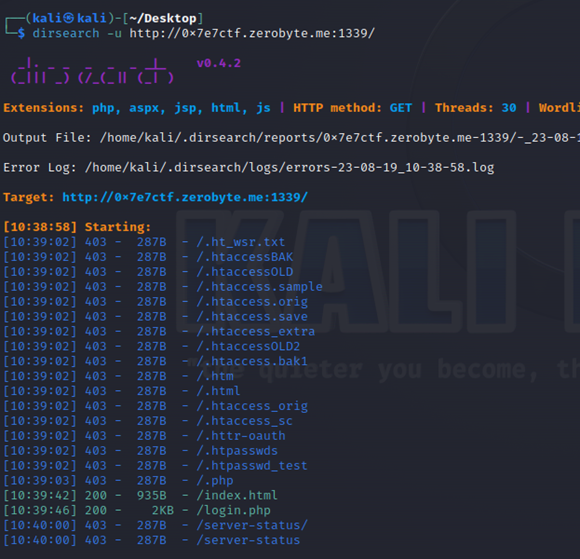
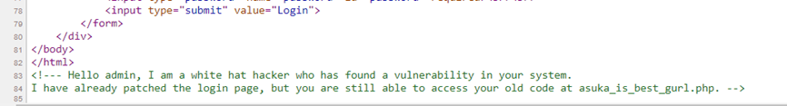
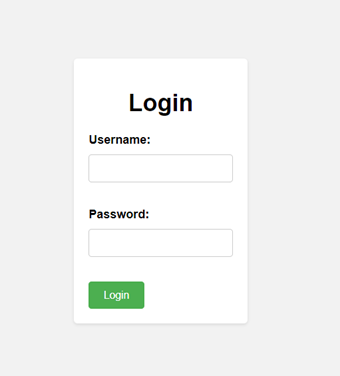
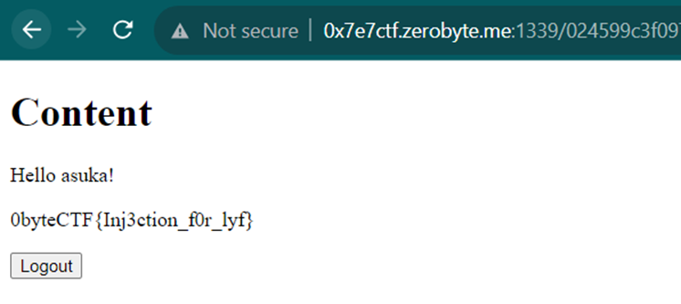

# the Injection
> Hack this out http://0x7e7ctf.zerobyte.me:1339/

## About the Challenge
You've been provided with a website without the source code, where only static pages exist without any information on the site.


## How to Solve?
Since there's no information on this page, a directory brute force using `dirsearch` is conducted. Here's the command I used:

```bash
dirsearch -u http://0x7e7ctf.zerobyte.me:1339/
```



There's a file named `login.php,` and when accessed, it displays a login page without any additional features like registration or password recovery. If you view the page source by pressing `Ctrl + U,` there's an HTML comment containing another endpoint named `asuka_is_best_gurl.php`



When accessing this endpoint, it turns out there's the same login page. However, based on the previous HTML comment, this PHP file is vulnerable to a certain vulnerability.



If there's a login page, the first thing typically attempted is SQL Injection, by inputting:

```
username: ' or true-- -
password: test
```


After inputting the SQL injection payload, here I logged in with the username `shinji`, but the flag didn't appear using the username `shinji`. So, I'm going to try to find other usernames using SQLMap, targeting the `asuka_is_best_gurl.php` endpoint. Below is the command I used to find usernames on this site:

```bash
sqlmap -u http://0x7e7ctf.zerobyte.me:1339/asuka_is_best_gurl.php --forms --dump
```

There are 5 users found in the `asuka_db` database.


Then, here I will attempt to log in one by one using the existing usernames. The payload I'm using is as follows:

```
username: asuka' order by 1-- -
password: test
```



```
0byteCTF{Inj3ction_f0r_lyf}
```