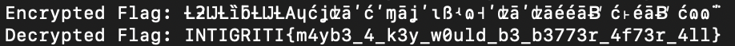

# Keyless
> My friend made a new encryption algorithm. Apparently it's so advanced, you don't even need a key!

## About the Challenge
We were given `keyless.zip` file that contains 2 files: `flag.txt.enc` and `enc.py`. Here is the content of `enc.py`

```python
def encrypt(message):
    encrypted_message = ""
    for char in message:
        a = (ord(char) * 2) + 10
        b = (a ^ 42) + 5
        c = (b * 3) - 7
        encrypted_char = c ^ 23
        encrypted_message += chr(encrypted_char)
    return encrypted_message

flag = "INTIGRITI{REDACTED}"
encrypted_flag = encrypt(flag)

with open("flag.txt.enc", "w") as file:
    file.write(encrypted_flag)
```

Here's a simple breakdown of the encryption process:

1. For each character in the input message:
2. Multiply the ASCII value of the character by 2 and add 10 (result stored in variable a).
3. XOR (^) the value of a with 42 and add 5 (result stored in variable b).
4. Multiply the value of b by 3 and subtract 7 (result stored in variable c).
5. XOR the value of c with 23 to get the final encrypted character.
6. Append the encrypted character to the encrypted_message string.

## How to Solve?
To solve the problem, I created another python script to reverse the encryption process

```
def decrypt(encrypted_message):
    decrypted_message = ""
    for char in encrypted_message:
        decrypted_char = ord(char) ^ 23
        c = decrypted_char + 7
        b = c // 3
        a = (b - 5) ^ 42
        original_char = (a - 10) // 2
        decrypted_message += chr(original_char)
    return decrypted_message

with open("flag.txt.enc", "r") as file:
    encrypted_flag = file.read()

decrypted_flag = decrypt(encrypted_flag)

print("Encrypted Flag:", encrypted_flag)
print("Decrypted Flag:", decrypted_flag)
```

Run the script and voilà!



```
INTIGRITI{m4yb3_4_k3y_w0uld_b3_b3773r_4f73r_4ll}
```