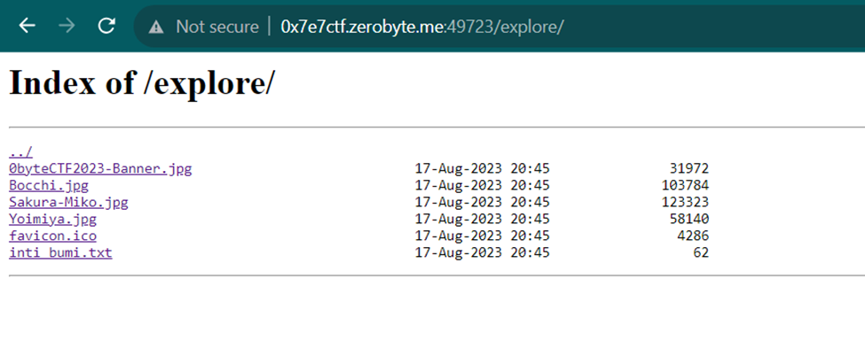
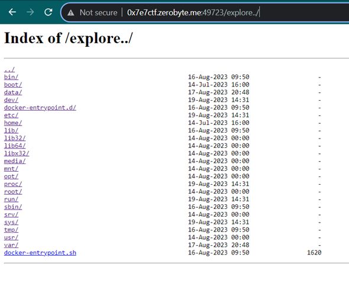
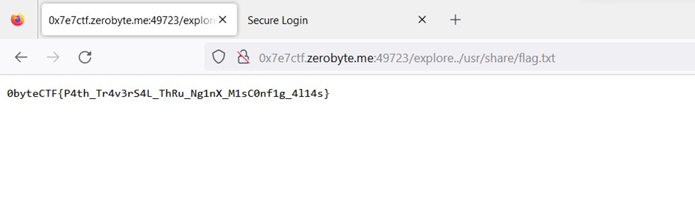

# Just Explore!
> Just explore and find a vulnerability innit :)

> http://0x7e7ctf.zerobyte.me:49723/

## About the Challenge
Given a website without the source code and on the main page, there's an endpoint named `/explore` which contains a somewhat random file.



## How to Solve?
If you observe the HTTP response header and see that the site is using NGINX as the web server, there's a possibility that the site might be vulnerable to path traversal if there's a misconfiguration in NGINX. An example of this can be seen on a site like this: https://www.acunetix.com/vulnerabilities/web/path-traversal-via-misconfigured-nginx-alias/. To perform path traversal, you'd need to add `../` to the URL after `explore`.



And my suspicion is correct; the site is vulnerable to path traversal. The next step is to find the `flag.txt` file on the server, and after searching for a while, the flag is located in the directory `/usr/share/flag.txt`.



```
0byteCTF{P4th_Tr4v3rS4L_ThRu_Ng1nX_M1sC0nf1g_4l14s}
```