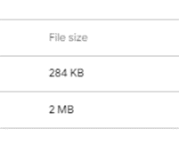
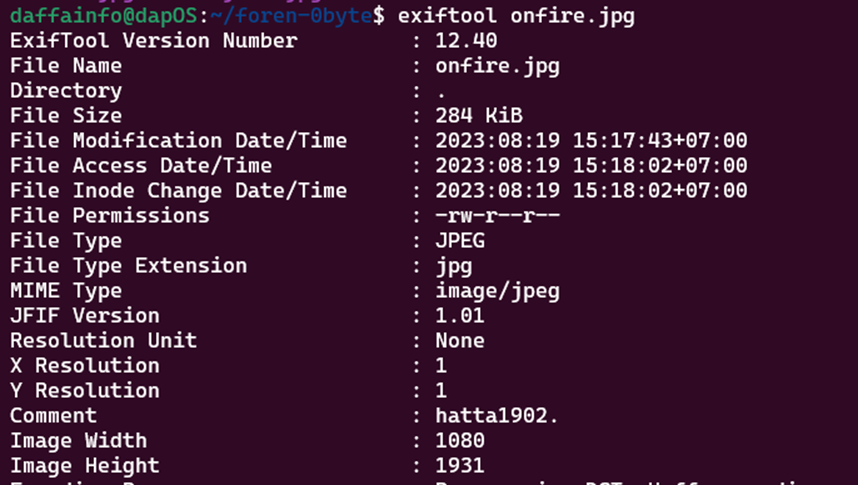
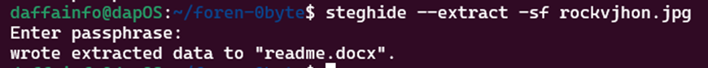
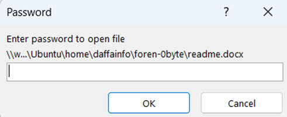
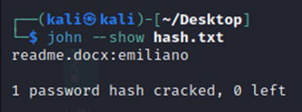
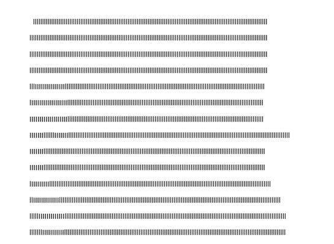
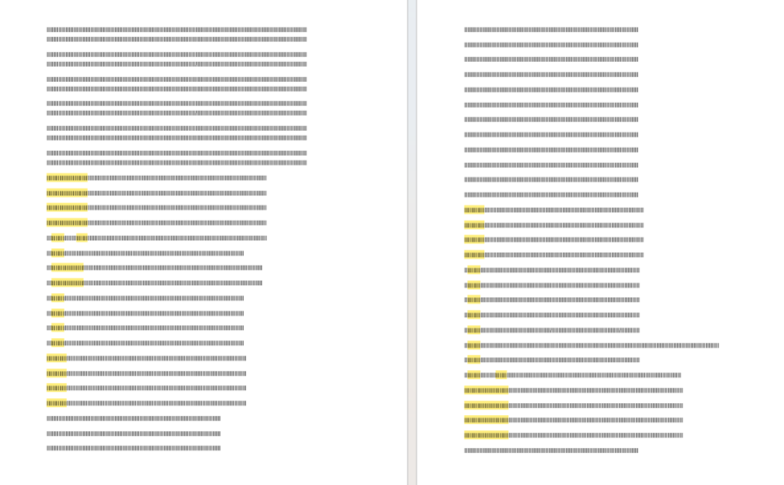
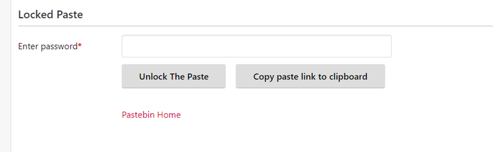
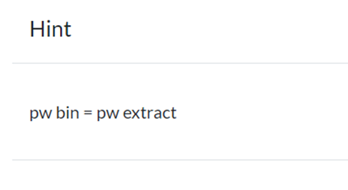

# One of the greatest matches of all time!
> The stage was set for an epic showdown as two of the biggest WWE superstars of their generations, The Rock and John Cena, faced off in a match that was billed as "Once in a Lifetime." The atmosphere in the Sun Life Stadium was electrifying, with fans from around the world eagerly anticipating this clash of titans.

## About the Challenge
Given a ZIP file containing 2 images: `onfire.jpg` and `rockvjohn.jpg`. These two files have significantly different file sizes, with `onfire.jpg` being 284 KB and `rockvjohn.jpg` being 2 MB. (You can download the file [here](One of the greatest matches of all time.zip))



## How to Solve?
The first step is to use the `exiftool` command to display metadata from a file. So, I will use exiftool on both of these files. Here's the command I used:

```bash
exiftool onfire.jpg
exiftool rockvjhon.jpg
```



The exiftool results for `rockvjohn.jpg` are not interesting, in contrast to the file `onfire.jpg`. There is a comment that says `hatta1902.` There is a possibility that this is a password that can be used on the file `rockvjhon.jpg` considering that the file size is unusual. Here is the command I used, which is `steghide` to perform file extraction because steganographic techniques have been applied to the file.



My suspicion turned out to be correct, and there is a file with the `.docx` extension generated using the command above. Now, we will move to the file `readme.docx`. When the file is opened, there is a password that locks this file.



To unlock this password, we will need to use `John The Ripper` to perform password cracking and `office2john` to convert the document file that will undergo brute force into the john format. Here's the command I used to perform password cracking on the Word document.

```bash
office2john readme.docx > hash.txt
john -w=/usr/share/wordlists/rockyou.txt hash.txt
```

After that, wait for `John` to successfully crack the password. If you want to see the cracked password, then execute the command below.

```bash
john –show hash.txt
```



The password for this document is `emiliano`. Let's open the file using the obtained password.



Inside the file, there are seemingly random lines. However, upon closer inspection, these lines are not just lowercase `l` letters; there are also capital `I` letters interspersed within the arrangement of lines. If you use the search feature in Word to look for capital `I` letters, you will find a letter on each page.



For example, the image above represents pages 7 and 8, forming the characters `F` and `L`. If all these characters are collected, you will find a shortlink: https://s.id/1FLAGHERE945. If you open this link, you will be redirected to a locked Pastebin page.



Fortunately, there's a hint: the password for the Pastebin is the same as the password to extract the file.



And finally, I entered the password `emiliano`, which is the password I used to unlock the locked document file.


```
0byteCTF{JH0N_&_R0cK_Ar3_B3st_Fr1eNd}
```