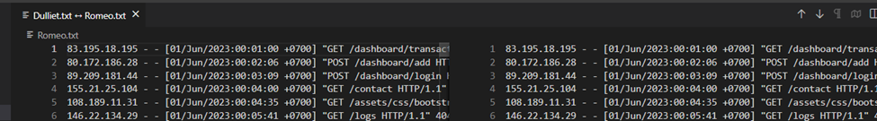
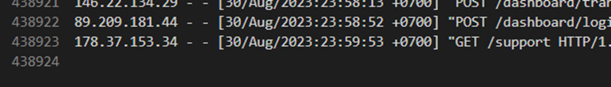
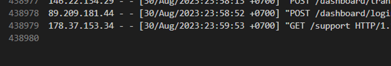
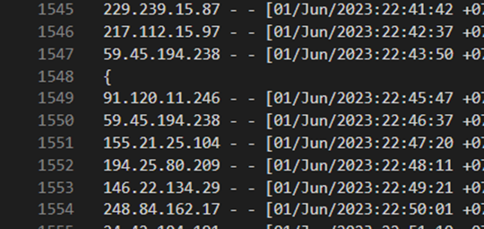
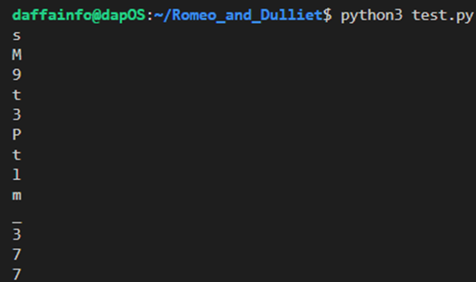
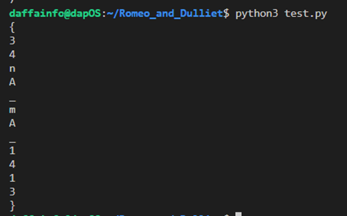

# Romeo and Dulliet
> Romeo dan dulliet merupakan sepasang kekasih, Mereka berdua memutuskan untuk tetap bersama meskipun segala rintangan, dan dengan bantuan Friar Laurence, seorang pendeta yang berharap bahwa pernikahan mereka bisa memperdamaikan keluarga-keluarga tersebut, mereka merencanakan pernikahan rahasia. Sayangnya, situasi semakin memburuk ketika Tybalt, sepupu dulliet, menantang Romeo untuk duel karena ia merasa terhina oleh kedatangan Romeo ke pesta mereka. tugas kalian carilah kelebihan dan kekurangan dari sepasang kekasih ini.

## About the Challenge
Given a ZIP file containing two server logs from a website named `Dulliet.txt` and `Romeo.txt`. Each log file has a large file size of around 66 megabytes. Upon initial inspection, it appears that the two files are similar in content.



## How to Solve?
If these two log files are further analyzed, it becomes apparent that there are some differences between them. Firstly, the number of lines in the `Dulliet.txt` log file is 438,923 lines.



Meanwhile, the `Romeo.txt` log file contains a total of 438,979 lines.



When I attempted to find suspicious requests in both logs, I discovered several lines where each line contained only one character. For example, as shown in the image below:



In the `Romeo.txt` file, at line 1548, there's a `{` character, which is typically a format used in CTF flags. Following this, I tried to create a Python script to search for a similar lines that contain only 1 character.

```python
with open('Dulliet.txt', 'r') as log_file:
    for line in log_file:
        line = line.strip()
        if len(line) == 1:
            print(line)
```

Then, run the above code on both the `Dulliet.txt` and `Romeo.txt` files. Here are the results:





At first glance, both lists of characters seem to resemble a flag, although they appear to be somewhat jumbled. In this case, I tried manually flipping and combining both sets of characters, which eventually formed a flag.

```
0byteCTF{s3M4n9At_3mPAt_l1m4_1337}
```