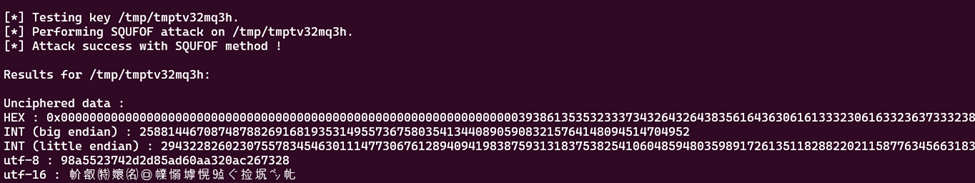
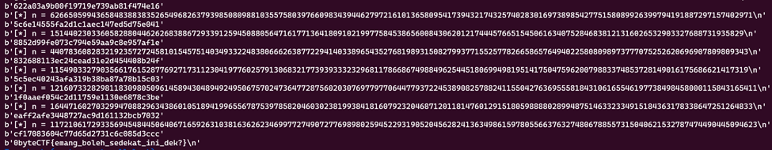

# Token
> Decrypt the token

## About the Challenge
The provided program is a Python script that implements a cryptographic game. In this game, the program generates a series of random tokens, and the player has to input the correct token to win the game. These tokens are generated by randomly choosing characters from the set `0123456789abcdef` for a length of 32 characters.

Each time the player enters the correct token, the program generates two random prime numbers, calculates the modulus of the multiplication of these two numbers, and uses a fixed exponent (0x10001 or 65537) to perform encryption operations on the token. The encrypted token and its cryptographic parameters are printed, and the player needs to input the corresponding token. If the player correctly inputs the token 100 times, the flag will be printed. However, if the player makes even one incorrect attempt, the program will end.

```python
#!/usr/bin/env python3

from sympy import nextprime
from Crypto.Util.number import *
from random import choice
from flag import flag


def get_prime(n):
	r = getRandomInteger(n)
	p = nextprime(r)
	q = nextprime(r + getRandomInteger(32))
	return p, q

def get_token(l):
	return ''.join(choice('0123456789abcdef') for i in range(l))


correct = 0
while correct < 100:
	token = get_token(32)
	p, q = get_prime(256)
	n = p * q
	e = 0x10001
	m = bytes_to_long(token.encode())
	c = pow(m,e,n)

	print(f'[*] {n = }')
	print(f'[*] {e = }')
	print(f'[*] {c = }')

	answer = input("[TOKEN]> ")
	if answer == token:
		correct += 1
		print()
	else:
		exit(0)

print(flag)
```

## How to Solve?
Since this is an RSA challenge, I will use `RsaCtfTool`, which can be accessed in this repository: https://github.com/RsaCtfTool/RsaCtfTool. The command I used is as follows, taking one of the sample outputs from the server.

```bash
python3 RsaCtfTool.py -n 7269896398942751313404998468295986128862222329376625697025973239308668324343236405631631699065470706683897767391236403789451011065655516118499702813482523 -e 65537 --uncipher 3792027385448390677301120427312148659896623308858159996054213078559387591588782223572434360836211851421167883252676191360621136176901652226598967453688583
```



This attack succeeded using the SQUFOF (Shanks's Square Forms Factorization) technique. The token seems to be in the UTF-8 section, and due to the 100 attempts on this server, it's impossible to do this manually. Hence, a Python script was created to automate this process. Some functions were taken from RsaCtfTool, such as `gcd`, `isqrt`, and the `SQUFOF` function itself. After obtaining the prime values p and q as a result of the SQUFOF function, decryption was performed on the ciphertext.

```python
from pwn import *
from Crypto.Util.number import inverse, long_to_bytes
import re

def gcd(a, b):
    while b:
        a, b = b, a % b
    return abs(a)

def isqrt(n):
    if n == 0:
        return 0
    x, y = n, (n + 1) >> 1
    while y < x:
        x, y = y, (y + n // y) >> 1
    return x

multiplier = [
    1,
    3,
    5,
    7,
    11,
    3 * 5,
    3 * 7,
    3 * 11,
    5 * 7,
    5 * 11,
    7 * 11,
    3 * 5 * 7,
    3 * 5 * 11,
    3 * 7 * 11,
    5 * 7 * 11,
    3 * 5 * 7 * 11,
]

def SQUFOF(N):
    s = isqrt(N)
    L = isqrt(s << 1) << 1
    B = 3 * L

    for k in range(0, len(multiplier)):
        D = multiplier[k] * N
        Po = Pprev = P = isqrt(D)
        Qprev = 1
        Q = D - (Po * Po)
        for i in range(2, B + 1):
            b = (Po + P) // Q
            P = b * Q - P
            q = Q
            Q = Qprev + b * (Pprev - P)
            r = isqrt(Q)
            if not (i & 1) and (r * r) == Q: break
            Pprev, Qprev = P, q
        b = (Po - P) // r
        Pprev = P = b * r + P
        Qprev = r
        Q = (D - (Pprev * Pprev)) // Qprev
        c1 = True
        while c1:
            b = (Po + P) // Q
            Pprev = P
            P = b * Q - P
            q = Q
            Q = Qprev + b * (Pprev - P)
            Qprev = q
            c1 = (P != Pprev)
        r = gcd(N, Qprev)
        if 1 < r < N:
            return r, N // r
    return None

def decrypt(n,e,c):
    p,q = SQUFOF(n)
 
    phi = (p-1)*(q-1)
 
    d = inverse(e, phi)
 
    m = pow(c,d,n)
 
    return m

p = remote('0x7e7ctf.zerobyte.me', 10021)
while True:
    n = p.recvline()
    print(n)
    equal_sign_index = n.index(b'=')
    n = n[equal_sign_index + 2:].strip()
    n = int(n.decode('utf-8'))

    e = p.recvline()
    equal_sign_index = e.index(b'=')
    e = e[equal_sign_index + 2:].strip()
    e = int(e.decode('utf-8'))

    c = p.recvline()
    equal_sign_index = c.index(b'=')
    c = c[equal_sign_index + 2:].strip()
    c = int(c.decode('utf-8'))

    m = decrypt(n,e,c)

    print(long_to_bytes(m))

    p.sendlineafter("[TOKEN]> ", long_to_bytes(m))
    p.recvline()
```



```
0byteCTF{emang_boleh_sedekat_ini_dek?}
```