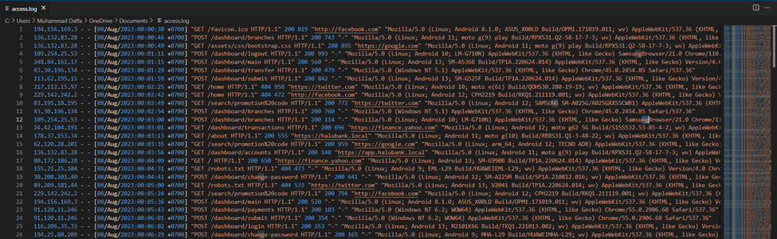
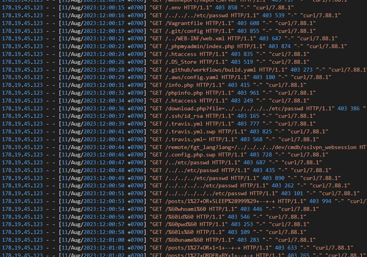
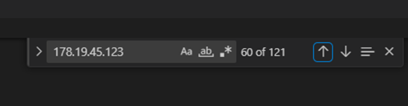
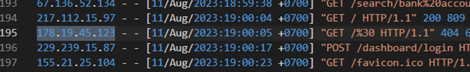
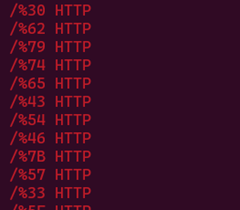
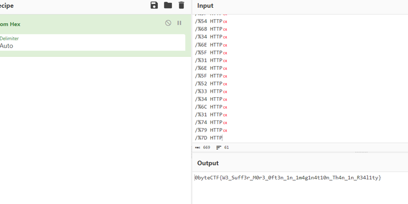

# Who the Hack
> ---------- Email ----------

> Subject: URGENT! Anomali Sistem From: farel@halubank.local To: itsec+dfir@halubank.local <2023-08-12 19:46:26>

> Dear Tim IT Security,

> Tim monitoring mendapati bahwa sistem aplikasi mengalami down saat jam makan siang tadi, namun hanya beberapa menit saja. Berikut ini saya lampirkan access.log dari server terkait, mohon untuk diperiksa segera, apakah ada anomali yang terjadi atau tidak.

> Terima kasih.

## About the Challenge
Given a ZIP file containing server logs from a website. There are 39,099 lines in this log, and the log covers timestamps from August 8, 2023, to August 14, 2023. (You can download the file [here](access.zip))



## How to Solve?
The first thing I did was to search for any suspicious requests, such as hacking attempts or random requests. In the log, I found 1 IP address, which is `178.19.45.123`, that seems to be involved in hacking attempts.





Upon further investigation, this IP address made 121 requests to the web server. After the 60th request, the IP initiated a peculiar request by inputting a percent character followed by two characters.



If we extract the suspicious requests using `cat` and `grep`, the command might look like this:

```bash
cat access.log  | grep "/%.*{2} HTTP" -Eo
```

Then a list of requests will appear as shown in the image below



Input the list of requests into CyberChef, then convert from hex to ASCII, and you should obtain a flag.



```
0byteCTF{W3_Suff3r_M0r3_0ft3n_1n_1m4g1n4t10n_Th4n_1n_R34l1ty}
```