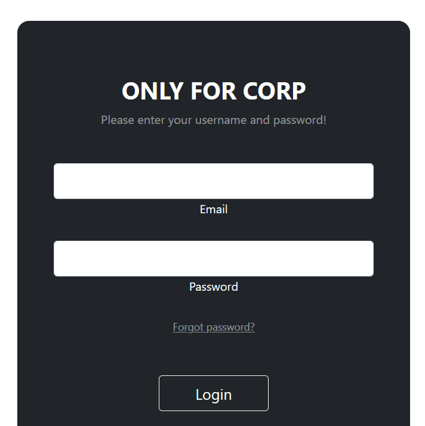
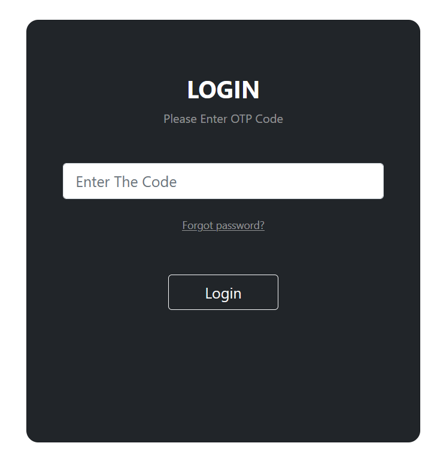
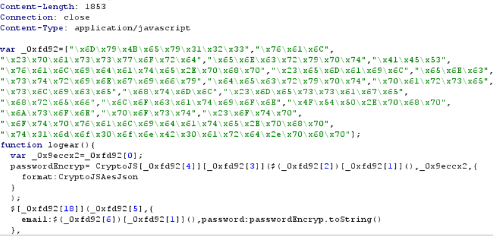

# bypasser
> `-`

## About the Challenge
We are given a website. There is a login page and we need to bypass the login page



## How to Solve?
After asking a hint to the admin, we know we need to bypass the login page but there are some filter. So the website is filtering some characters such as
```
' " ) % = SPACE
```
After doing some research and I found this [blog](https://www.invicti.com/blog/web-security/fragmented-sql-injection-attacks/) , i can bypass the login page by using this payload
```
user: \
pass: or/**/1/**/#
```

After that we will be redirected into `otp.php` endpoint



After redirected into `otp.php` endpoint. My burpsuite receive a lot of new javascript endpoint and I found `/bypasser/js/ExternalCustom.js` file and that is a obfuscated javascript



After i deobfuscate the file, I found new endpoint named `t1mo0onB0ard.php` and we will get the flag

```
0xL4ugh{YOU_ARE_A_DEBUGGER}
```