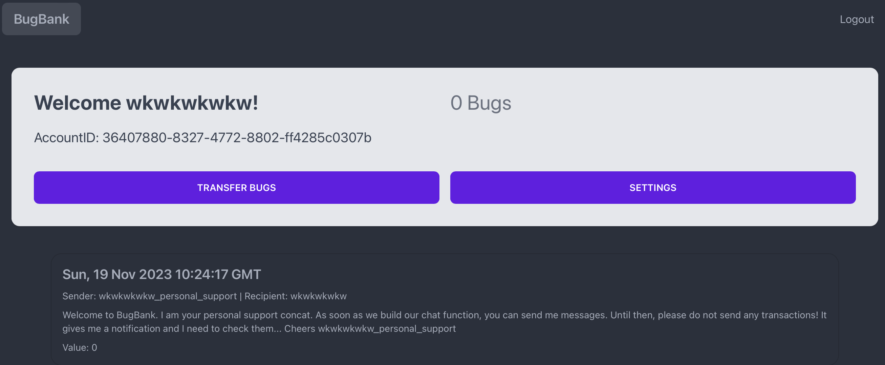
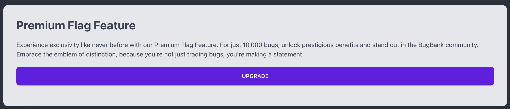
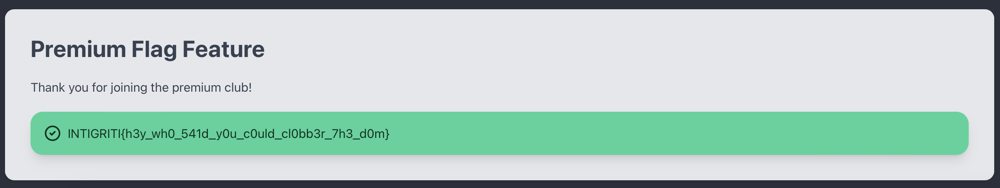

# Bug Bank
> Welcome to BugBank, the world's premier banking application for trading bugs! In this new era, bugs are more valuable than gold, and we have built the ultimate platform for you to handle your buggy assets. Trade enough bugs and you have the chance to become a premium member. And in case you have any questions, do not hesitate to contact your personal assistant. Happy trading!

## About the Challenge
We were given a website without the source code. Here is the preview of the website



And in order to get the flag, we need to have at least 10000 bugs on our account and then buy the `Premium Flag Feature`



## How to Solve?
There are 2 ways to solve this chall. The intended way from the author:
```
Get the ID of your support account via GraphQL, then send it a DOM Clobbering payload to hijack the service worker and sniff all the traffic:

https://portswigger.net/research/hijacking-service-workers-via-dom-clobbering
```

But in this case I solved it using an unintended way. So I created two accounts and then sent a negative value (Example: -10000000) to another account and then buy the flag



```
INTIGRITI{h3y_wh0_541d_y0u_c0uld_cl0bb3r_7h3_d0m}
```