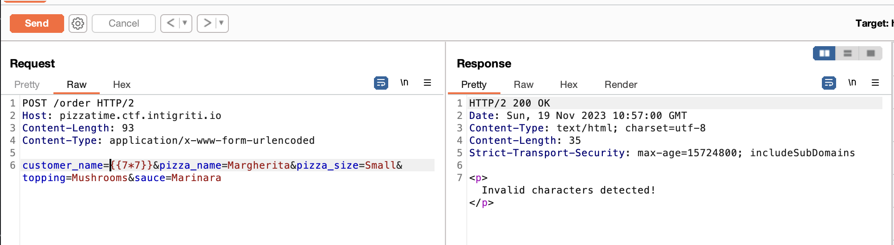
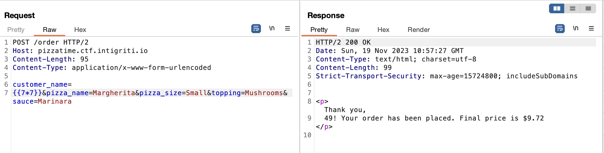
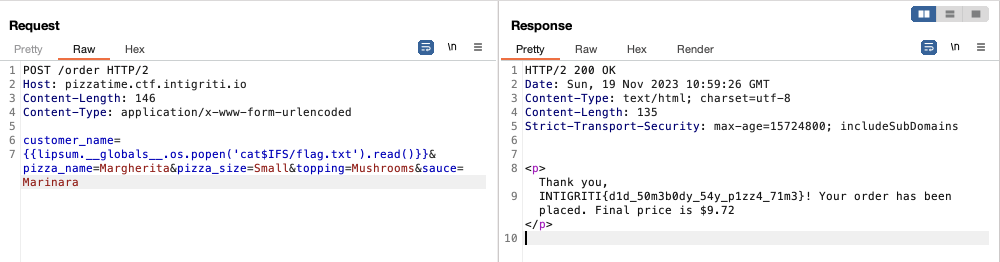

# Pizza Time
> It's pizza time!! 🍕

## About the Challenge
We were given a website without the source code, and there is only one functionality on this website (we can place an order) and our input is reflected in the output.


## How to Solve?
Im assuming this website is vulnerable to SSTI. At first I can't input any special characters such as `$`, `[`, `]`, etc. But when I tried to use newline character or `\n`, suddenly the website didn't filter my input again.

Normal Input:


Bypass:


And to obtain the flag, we need to escalate the SSTI to remote code execution. This is the final payload I used to read the flag

```
{{lipsum.__globals__.os.popen('cat$IFS/flag.txt').read()}}
```



```
INTIGRITI{d1d_50m3b0dy_54y_p1zz4_71m3}
```