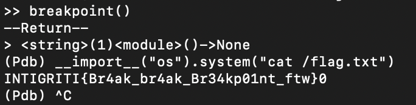

# Pyjail
> Can you break out of this python jail? 🐍

> P.S. flag is at /flag.txt

## About the Challenge
We were given a python script called `jail.py`. Here is the content of the file

```python
import ast
import unicodedata

blacklist = "0123456789[]\"\'._"
check = lambda x: any(w in blacklist for w in x)

def normalize_code(code):
    return unicodedata.normalize('NFKC', code)

def execute_code(code):
    try:
        normalized_code = normalize_code(code)
        parsed = ast.parse(code)
        for node in ast.walk(parsed):
            if isinstance(node, ast.Call):
                if isinstance(node.func, ast.Name):
                    if node.func.id in ("os","system","eval","exec","input","open"):
                        return "Access denied!"
            elif isinstance(node, ast.Import):
                return "No imports for you!"
        if check(code):
            return "Hey, no hacking!"
        else:
            return exec(normalized_code, {}, {})
    except Exception as e:
        return str(e)

if __name__ == "__main__":
    while True:
        user_code = input(">> ")
        if user_code.lower() == 'quit':
            break
        result = execute_code(user_code)
        print("Result:", result)

```

It looks like we can't execute some function such as `os`, `system`, `eval`, `exec`, `input`, `open` and also we cant input 0-9 plus some special characters

## How to Solve?
To solve this chall I used `breakpoint()` and then execute `__import__("os").system("cat /flag.txt")` to obtain the flag



```
INTIGRITI{Br4ak_br4ak_Br34kp01nt_ftw}
```