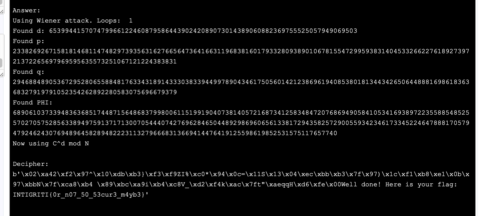

# Really Secure Apparently
> Apparently this encryption is "really secure" and I don't need to worry about sharing the ciphertext, or even these values..

> n = 689061037339483636851744871564868379980061151991904073814057216873412583484720768694905841053416938972235588548525570270575285633894975913717130070544407480547826227398039831409929129742007101671851757453656032161443946817685708282221883187089692065998793742064551244403369599965441075497085384181772038720949 e = 98161001623245946455371459972270637048947096740867123960987426843075734419854169415217693040603943985614577854750928453684840929755254248201161248375350238628917413291201125030514500977409961838501076015838508082749034318410808298025858181711613372870289482890074072555265382600388541381732534018133370862587

## About the Challenge
We were given a `n`, `e`, and also a file called `ciphertext` (You can download the file [here])

## How to Solve?
We can decrypt the ciphertext using the Wiener attack because the e value is so large. In this case, I'm using this [website](https://asecuritysite.com/ctf/rsa_ctf05) and then inputting the values of n, e, and c




```
INTIGRITI{0r_n07_50_53cur3_m4yb3}
```