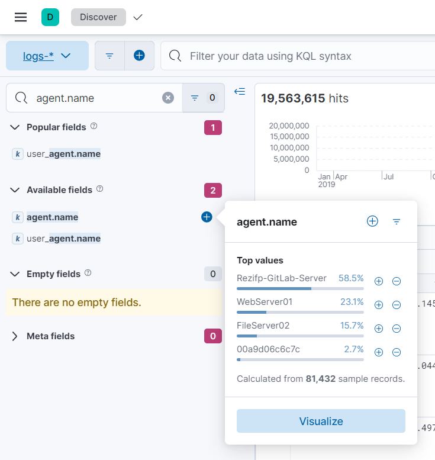

# Blue's Clues 1/8: Gitlab Server
> You are a blue team analyst working in a Security Operation Center (SOC) for Rezifp, a major pharmaceutical company that may or may not have developped a 91-divoc Vaccine.

> It's friday morning. You get several Teams messages in quick succession from Martin Mistigri, one of the devops engineer at your firm:

```
Yo blueeeeee whatsssss upppppp 🤜
There is some WEIRD stuff going on here no cap 😳
so
I was vibin, eating my chocolatine, and had some maintenance to do for our CI/CD pipeline on gitlab right
well IT TURNS OUT that a new pipeline has appeared out of nowhere?? 
the pipeline is called "Monitoring"
it's so sus 
anyway could u look at it and see if its legit or not
```

> You have been preparing for this moment for your whole carreer. Finally, a real breach??

> Equiped with your SIEM (Elastic stack), your EDRs (Elastic Defend) and your blue team knowledge, investigate the logs and find what happened.

> Note: This is a log analysis and investigation challenge. The important sections of the challenge will be the "security" section and the "discover" tab in the "Analytics" section. For reference on how to do searches in elasticsearch using the Kibana Query Language (KQL), refer to this link: https://www.elastic.co/guide/en/kibana/current/kuery-query.html

> Note: Flags in this track will not have the standard flag format. The flag format is specified in each challenge.

> Flag1: Find the name of the Gitlab Server.

## About the Challenge
We need to find the Gitlab server name

## How to Solve?
Go to `Analytics` menu and then choose `Discover` menu


And then search `agent.name` in `Search` form. Press that to see the name of the Gitlab server



```
Rezifp-Gitlab-Server
```