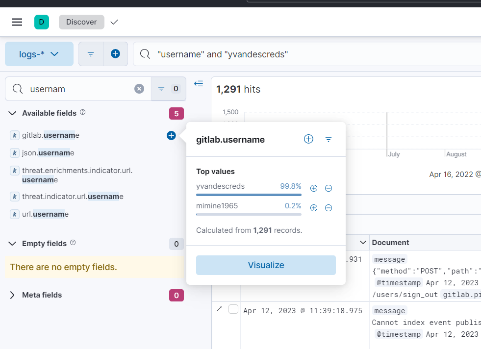
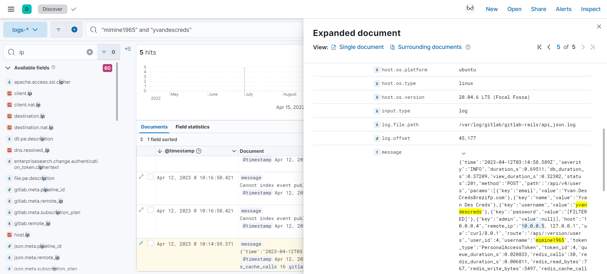

# Blue's Clues 3/8: Source IP
> Martin has no idea who this user is, it's not a Rezifp employee and it has admin privileges. From which IP was this user created, by which user, using which user agent, and using which type of gitlab token?

> Flag format: <creator_username>|<source_ip>|<user_agent>|<gitlab_token_type>

> Not case sensitive.

> Example: myaccount|127.0.0.1|someuseragent|SomeTokenType

## About the Challenge
We need to find the some information for example, username, source ip, etc that created `yvandescreds` account

## How to Solve?
First, I searched the username in the KQL syntax and then I want to find the log that contains string `username`. And if we check the result of `gitlab.username` search field, the result is `mimine1965` created that user



After that, I changed the KQL syntax like the image below because I want to find the log when `mimine1965` created `yvandescreds`. Choose the oldest logs and you will obtain some information



```
mimine1965|10.0.0.5|curl/8.0.1|PersonalAccessToken
```