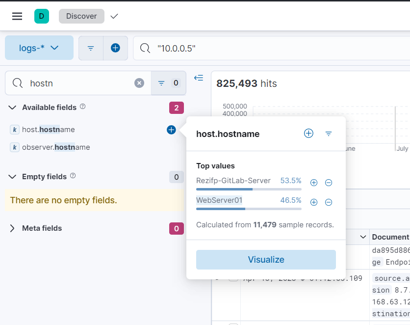

# Blue's Clues 4/8: Source Machine
> What? It's an internal IP? What is the hostname of this IP?

> Flag format: <hostname>

> Not case sensitive.

## About the Challenge
We need to find the hostname of the IP (10.0.0.5)

## How to Solve?
I searched about `10.0.0.5` in KQL syntax form and then if we check the result of `host.hostname`. The hostname is WebServer01



```
WebServer01
```