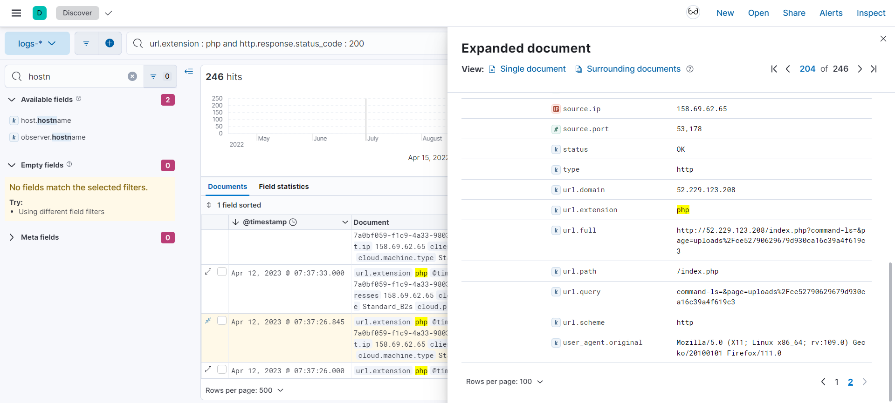

# Blue's Clues 5/8: Initial Access
> The web server?? How did the threat actor get access to the web server? Surely we have logs for that... It hosts a simple PHP website, nothing complex.

> Find the malicious file.

> Flag format: <filename>.<fileextension>

> Example: mywebshell.aspx

## About the Challenge
We need to find the name of the webshell

## How to Solve?
Im using this KQL syntax because I want to find the URL that using `PHP` extension and the HTTP response code returned `200 OK`

```
url.extension : php and http.response.status_code : 200
```

And then I searched the log one by one until I found this weird PHP file



```
ce52790629679d930ca16c39a4f619c3.php
```