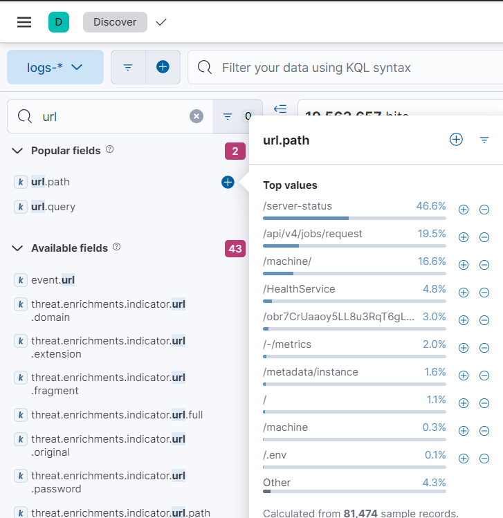
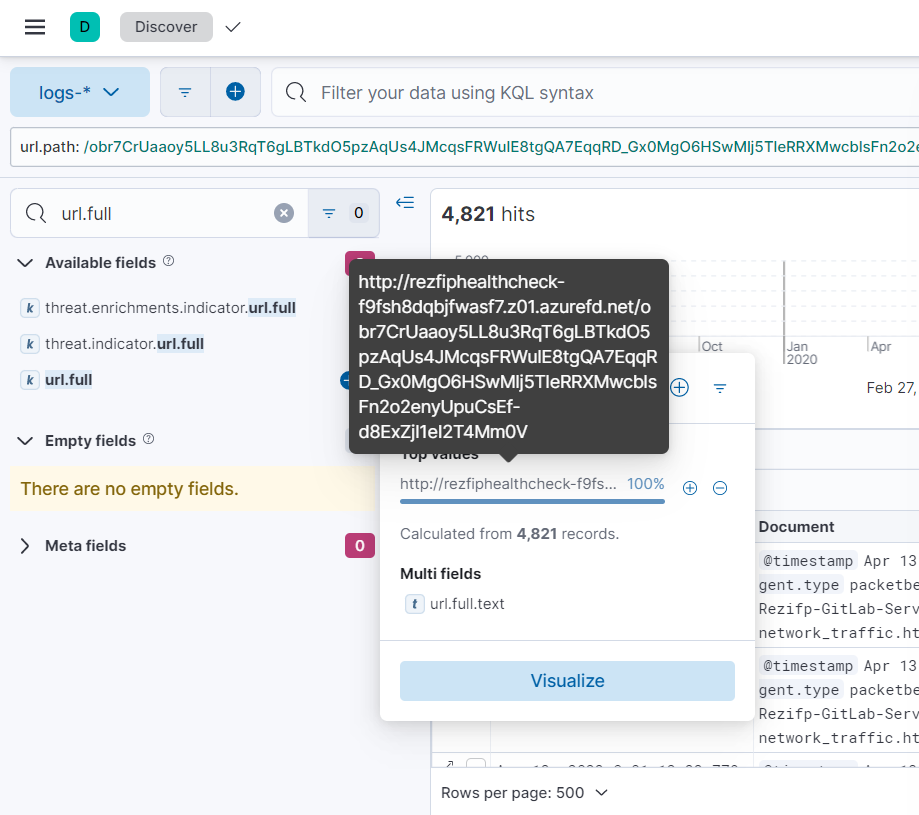

# Blue's Clues 8/8: C2
> The pipeline executes on the gitlab server itself. It must be some kind of persistence. Find the C2.

> Flag Format: <domain_name>

> Lowercase.

> Example: a.b.google.com

## About the Challenge
We need to find the C2 domain name

## How to Solve?
Without using any KQL syntax, check the `url.path` result



You will notice there is a very long URL path called `obr7CrUaaoy5LL8u3RqT6gLBTkdO5pzAqUs4JMcqsFRWulE8tgQA7EqqRD_Gx0MgO6HSwMlj5TleRRXMwcblsFn2o2enyUpuCsEf-d8ExZjl1eI2T4Mm0V`. Press the plus button to add the URL path into KQL syntax



Now check the `url.full` result to obtain the C2 server name

```
rezfiphealthcheck-f9fsh8dqbjfwasf7.z01.azurefd.net
```