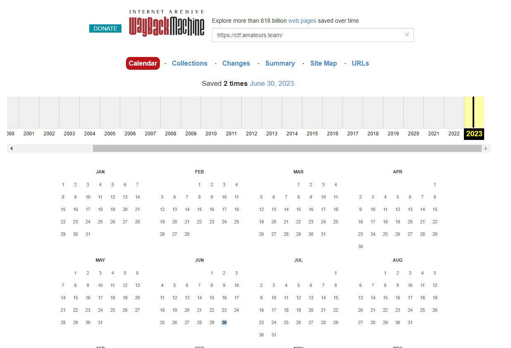
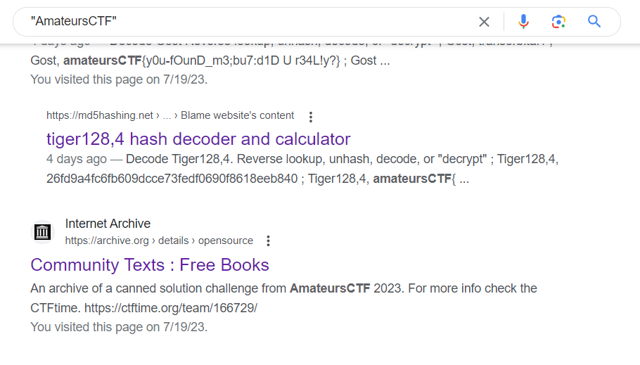
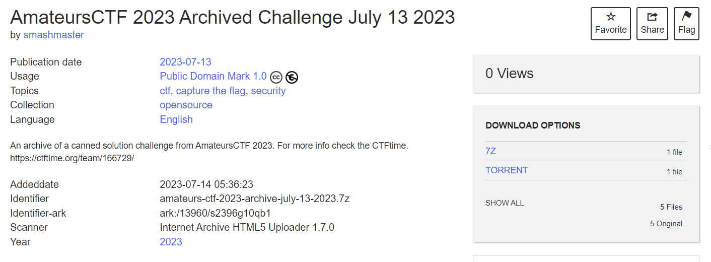
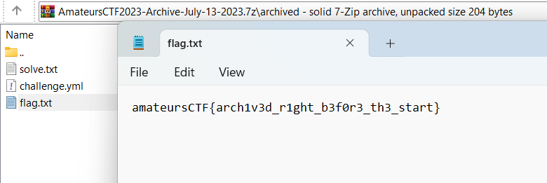

# Archived
> This challenge has been archived.

## About the Challenge
We need to find archived challenge using OSINT technique

## How to Solve?
At first im using web.archive.org to find archived website but I found nothing here



And then I tried to googling about `AmateursCTF` and I found this search result



Result from archive.org? interesting. And then we got this archived [challenge](https://archive.org/details/amateurs-ctf-2023-archive-july-13-2023.7z)



Download the archived challenge, and then read `flag.txt` to obtain the flag



```
amateursCTF{arch1v3d_r1ght_b3f0r3_th3_start}
```