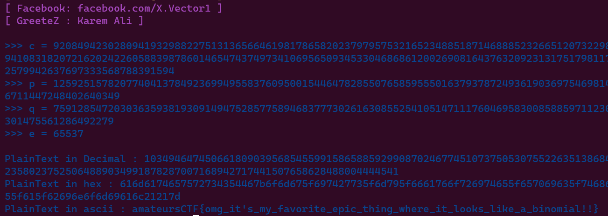

# You get extra information 2
> You get more information! More complicated = more information right.

## About the Challenge
We got 2 files, `main.py` and `output.txt`. Here is the content of `main.py`

```python
from Crypto.Util.number import *
from flag import flag

p = getPrime(512)
q = getPrime(512)
n = p*q
e = 0x10001
extra_information = (n**2)*(p**3 + 5*(p+1)**2) + 5*n*q + q**2
ptxt = bytes_to_long(flag)
c = pow(ptxt, e, n)

with open('output.txt', 'w') as f:
    f.write(f"n: {n}\nc: {c}\ne: {e}\nextra_information: {extra_information}")
```

This is a basic RSA, but there is another variable called `extract_information`. And here is the content of `output.txt`

```
n: 95593382112797270045497836514999308524326160650345266525670495575191979116591752182138270308274446464071024826510473429700676303637674960212123982700153540490805215151070356646141514736282385755143090035980011032465519861526291865888128545478530962058792257703950616556136479933021373472378679162332202365371
c: 92084942302809419329882275131365664619817865820237979575321652348851871468885232665120732298048355621943772250718055278615366362227084559410831820721620242260588398786014654743749734106956509345330468686120026908164376320923131751798117799981744551407234489862207435686504148347452579942637697333568788391594
e: 65537
extra_information: 18247071175606431398122118602371784578875472790915317892207044424588309397797319375039984309368393267673885302107217184699052743790470091033147110959310433418937324145720036262540098007724458652548486534453030546582214242131458903058169536052488501597969216020092796160475487905223265691093061136660574497410399108890645909789835984721231354187679269066357591297035974333220513134895660609801438138623213711900681512310067292949714127564635579383633589101296120704659647911638787823818973909534106275908594589830353183557722172234952579827423906720754070119865452363350814918812923981729393142874903734028229195885438296963982680724071663211427931391032589901737528717167662646147224323491202696402122261699504048973334902281462240308032014697804531871922566779026958815207465755155123070196922127199447785648102152027431894178737946151518726929361221425189695069653652163012000609320105988830299015364692678902927254273154427301473090465612473379114039284029813071586214536353994345527805408387636097772645156970939979500155578289301143563369142329343932852167241705090287661795
```

## How to Solve?
To solve this problem, we need to find the value of prime number first, `p` and `q` and then we can decode the encrypted flag. To find the value of `p` and `q`, i created a program that using Z3 package. Here is the program I used to find `p` and `q`

```python
from z3 import *

# Define the variables
p, q = Ints('p q')

# Define the known values
n = 95593382112797270045497836514999308524326160650345266525670495575191979116591752182138270308274446464071024826510473429700676303637674960212123982700153540490805215151070356646141514736282385755143090035980011032465519861526291865888128545478530962058792257703950616556136479933021373472378679162332202365371
e = 0x10001
extra_information = 18247071175606431398122118602371784578875472790915317892207044424588309397797319375039984309368393267673885302107217184699052743790470091033147110959310433418937324145720036262540098007724458652548486534453030546582214242131458903058169536052488501597969216020092796160475487905223265691093061136660574497410399108890645909789835984721231354187679269066357591297035974333220513134895660609801438138623213711900681512310067292949714127564635579383633589101296120704659647911638787823818973909534106275908594589830353183557722172234952579827423906720754070119865452363350814918812923981729393142874903734028229195885438296963982680724071663211427931391032589901737528717167662646147224323491202696402122261699504048973334902281462240308032014697804531871922566779026958815207465755155123070196922127199447785648102152027431894178737946151518726929361221425189695069653652163012000609320105988830299015364692678902927254273154427301473090465612473379114039284029813071586214536353994345527805408387636097772645156970939979500155578289301143563369142329343932852167241705090287661795

# Define the constraints
constraints = [
    p * q == n,
    (n ** 2) * (p ** 3 + 5 * (p + 1) ** 2) + 5 * n * q + q ** 2 == extra_information
]

# Create a solver instance
solver = Solver()

# Add the constraints to the solver
solver.add(constraints)

# Check if the constraints are satisfiable
if solver.check() == sat:
    # Constraints are satisfiable, get the model
    model = solver.model()
    # Get the values of p and q from the model
    p_value = model[p].as_long()
    q_value = model[q].as_long()
    print(f"p = {p_value}")
    print(f"q = {q_value}")
else:
    print("Constraints are unsatisfiable.")
```

Run the program, and then you will got the value of `p` and `q`


```
p = 12592515782077404137849236994955837609500154464782855076585955501637937872493619036975469814859697874798733737517472127306855726944300236711447248402640349
q = 7591285472030363593819309149475285775894683777302616308552541051471117604695830085885971123084425024738819800112718432254917427153283662301475561286492279
```

Because we got the prime number, now we can decode the flag. In this case im using [X-RSA](https://github.com/X-Vector/X-RSA)



```
amateursCTF{omg_it's_my_favorite_epic_thing_where_it_looks_like_a_binomial!!}
```