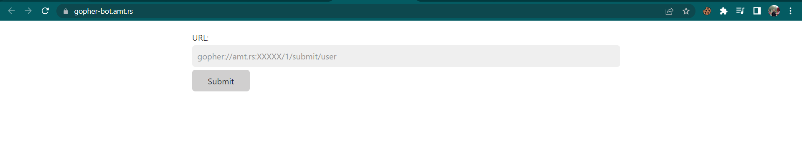
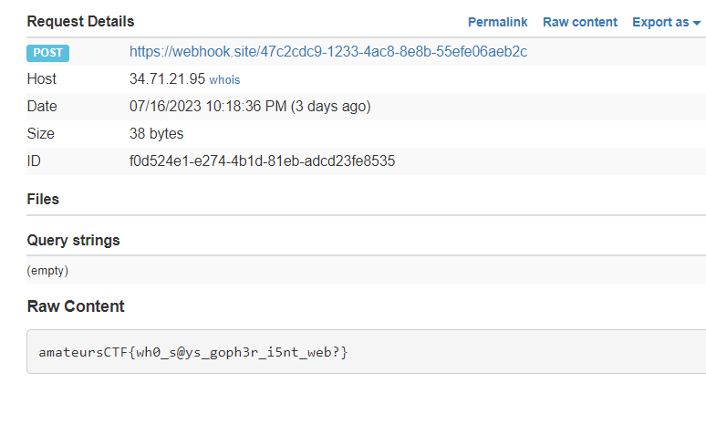

# go-gopher
> psst... i know flag sharing isn't allowed, and i found this page where someone seems to be recieving flags from someone else. can you somehow find a way to hijack this site so it gives me flags? thanks.

> gopher://amt.rs:31290/ gopher-bot.amt.rs

## About the Challenge
We got 2 files, `main.go` and `bot.go`. Here is the content of `main.go`

```golang
package main

import (
	"fmt"
	"log"
	"net/url"
	"strings"

	"git.mills.io/prologic/go-gopher"
)

func index(w gopher.ResponseWriter, r *gopher.Request) {
	w.WriteInfo("Welcome to the flag submitter!")
	w.WriteInfo("Please submit all your flags!")
	w.WriteItem(&gopher.Item{
		Type:        gopher.DIRECTORY,
		Selector:    "/submit/user",
		Description: "Submit flags here!",
	})
	w.WriteItem(&gopher.Item{
		Type:        gopher.FILE,
		Selector:    "URL:https://ctf.amateurs.team/",
		Description: "Get me more flags lackeys!!",
	})
	w.WriteItem(&gopher.Item{
		Type:        gopher.DIRECTORY,
		Selector:    "/",
		Description: "Nice gopher proxy",
		Host:        "gopher.floodgap.com",
		Port:        70,
	})
}

func submit(w gopher.ResponseWriter, r *gopher.Request) {
	name := strings.Split(r.Selector, "/")[2]
	undecoded, err := url.QueryUnescape(name)
	if err != nil {
		w.WriteError(err.Error())
	}
	w.WriteInfo(fmt.Sprintf("Hello %s", undecoded))
	w.WriteInfo("Please send a post request containing your flag at the server down below.")
	w.WriteItem(&gopher.Item{
		Type:        gopher.FILE,
		Selector:    "URL:http://amt.rs/gophers-catcher-not-in-scope",
		Description: "Submit here! (gopher doesn't have forms D:)",
		Host:        "error.host",
		Port:        1,
	})
}

func main() {
	mux := gopher.NewServeMux()

	mux.HandleFunc("/", index)
	mux.HandleFunc("/submit/", submit)

	log.Fatal(gopher.ListenAndServe("0.0.0.0:7000", mux))
}
```

This is a simple Gopher server written in Go, which serves a directory index and allows users to submit flags via a "flag submitter" interface by making a POST request containing the flag to the specified server. And here is the content of `bot.go`

```golang
package main

import (
	"bytes"
	"fmt"
	"log"
	"net/http"
	"net/url"
	"os"
	"strings"

	"git.mills.io/prologic/go-gopher"
)

var flag = []byte{}

func main() {
	content, err := os.ReadFile("flag.txt")
	if err != nil {
		log.Fatal(err)
	}
	flag = content

	http.HandleFunc("/submit", Submit)
	http.HandleFunc("/", Index)
	if err := http.ListenAndServe(":8080", nil); err != nil {
		log.Fatal(err)
	}
}

func Index(w http.ResponseWriter, r *http.Request) {
	http.ServeFile(w, r, "index.html")
}

func Submit(w http.ResponseWriter, r *http.Request) {
	r.ParseForm()
	u, err := url.Parse(r.Form.Get("url"))
	if err != nil || !strings.HasPrefix(u.Host, "amt.rs") {
		w.Write([]byte("Invalid url"))
		return
	}

	w.Write([]byte(Visit(r.Form.Get("url"))))
}

func Visit(url string) string {
	fmt.Println(url)
	res, err := gopher.Get(url)
	if err != nil {
		return fmt.Sprintf("Something went wrong: %s", err.Error())
	}
	h, _ := res.Dir.ToText()
	fmt.Println(string(h))

	url, _ = strings.CutPrefix(res.Dir.Items[2].Selector, "URL:")
	fmt.Println(url)
	_, err = http.Post(url, "text/plain", bytes.NewBuffer(flag))

	if err != nil {
		return "Failed to make request"
	}

	return "Successful visit"
}
```

This Go program is a simple web server that serves an HTML page at the root (`/`) and allows users to submit a URL through a form. When a URL is submitted, it validates if the host starts with `amt.rs` and then sends a Gopher request to that URL. The Gopher response is then used to extract a target URL, to which a POST request with a flag (read from `flag.txt` file) is made. The result of the visit is printed, indicating if the visit was successful or if there was an error during the process. And here is the preview of `bot.go`



## How to Solve?
As you can see, we need to input the gopher protocol into the bot, but we need to change the `selector` value from `http://amt.rs/gophers-catcher-not-in-scope` to our webhook / server. And then the bot will send us the flag to our server

```golang
func submit(w gopher.ResponseWriter, r *gopher.Request) {
	name := strings.Split(r.Selector, "/")[2]
	undecoded, err := url.QueryUnescape(name)
	if err != nil {
		w.WriteError(err.Error())
	}
	w.WriteInfo(fmt.Sprintf("Hello %s", undecoded))
	w.WriteInfo("Please send a post request containing your flag at the server down below.")
	w.WriteItem(&gopher.Item{
		Type:        gopher.FILE,
		Selector:    "URL:http://amt.rs/gophers-catcher-not-in-scope",
		Description: "Submit here! (gopher doesn't have forms D:)",
		Host:        "error.host",
		Port:        1,
	})
}
```

To solve this problem, I'm using `main.go` to serve our Gopher protocol, but I changed the selector value to my webhook URL. Although we are only allowed to input a host that starts with amt.rs, we can still bypass this restriction by adding an `A` record to your domain. This will create a subdomain called `amt.rs.yourwebsite.com`.


And then input your subdomain in the bot and check the webhook to obtain the flag



```
amateursCTF{wh0_s@ys_goph3r_i5nt_web?}
```