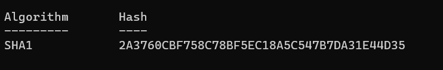

# Find Values
> Find The SHA 1 value Of the Windows 7 ovf and vmdk file

> Flag format: BDSEC{value1_value2}

## About the Challenge
Find the SHA1 value of `ovf` and `vmdk` file

## How to Solve?
To solve this, I unzip the `ova` file first, and then use this command to get the `SHA1` value (Im using powershell)

```
Get-FileHash -a SHA1 '.\Windows 7.ovf'
```


```
Get-FileHash -a SHA1 '.\Windows 7-disk001.vmdk'
```



```
BDSEC{11BC7CC41D7BA2FD92724500F4CBEC3F6D44108A_2A3760CBF758C78BF5EC18A5C547B7DA31E44D35}
```