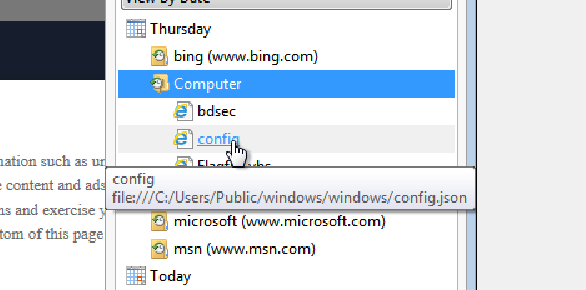
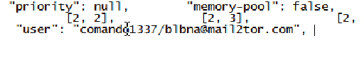

# Hackers username and email
> First hacker Much more intelligent.But he somehow mistake something. When I investigate this things. I see something jussy things which is Hackers Username and his Email address. Can you also find this?

> Flag Format: BDSEC{username_email}

## About the Challenge
We need to find the hacker's username and his email

## How to Solve?
First, i opened Internet explorer and check the history



As you can see, there is a suspicious file called `config.json`. Open the file to obtain the username and also the email address



```
BDSEC{comando1337_blbna@mail2tor.com}
```