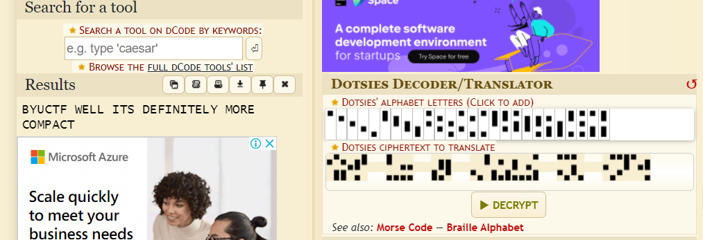

# Compact
> Apparently this is meant to replace the Latin alphabet??

> Flag format: byuctf{word or phrase} case insensitve.

## About the Challenge
We need to decode the message in the image below


## How to Solve?
To solve this, im using [Dotsies translator](https://www.dcode.fr/dotsies-writing) by dcode.fr



```
byuctf{well its definitely more compact}
```