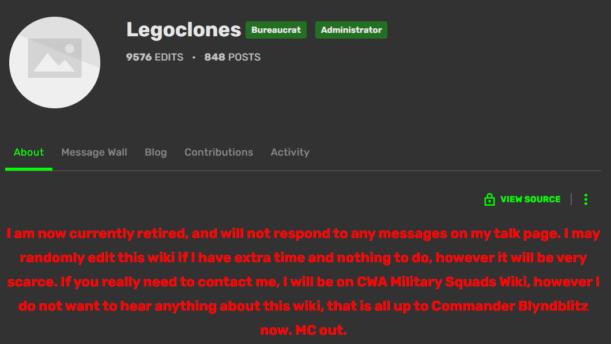

# Legoclones 1
> For some reason completely incomprehensible to mankind, you have become sworn enemies of one of the BYUCTF organizers, Legoclones. In your efforts to defeat him, you have decided to go back to the origins of Legoclones to learn more about him. This is what you know so far:

> He once claimed that he's been going by the moniker "Legoclones" for over a decade
There was a website that he adopted and fostered for about 3 years, based on a specific, niche area of Star Wars
Your goal now is to find this website that he claims as "his". When he retired from the website, he stated he was leaving it in the hands of Commander ????. What was the username of the person he turned the site over to?

> Notes from the organizer:

> The remaining 4 Legoclones-related OSINT challenges will open up after this one
> Doxxing Legoclones in real-life will not help you in any of these OSINT challenges. Stick to Legoclones and not his real-life counterpart
> Flag format - byuctf{Username}

## About the Challenge
We have to find the username that took over the website when `Legoclones` retired

## How to Solve?
At first im using [whatsmyname.app](https://whatsmyname.app/) to find any account related to `Legoclones`. And I found `Legoclones` have a reddit account. And if we check the account, I found there is 1 comment about his website


Go to the website and find his account and you will find the username that took over the fandom account

https://clonetrooper.fandom.com/wiki/User:Legoclones



```
byuctf{Blyndblitz}
```