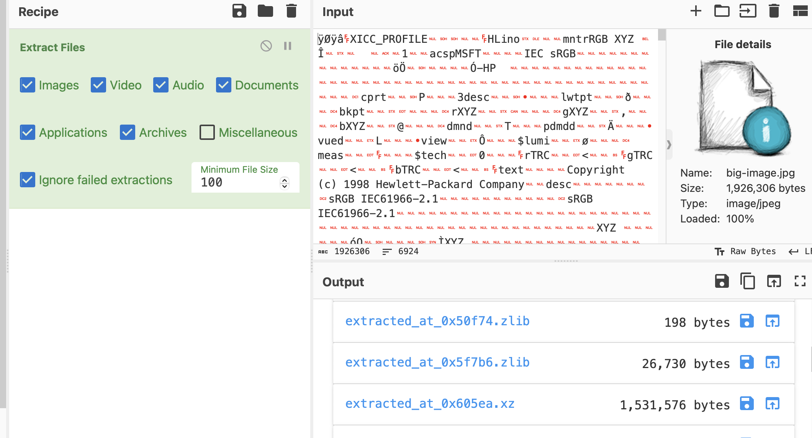
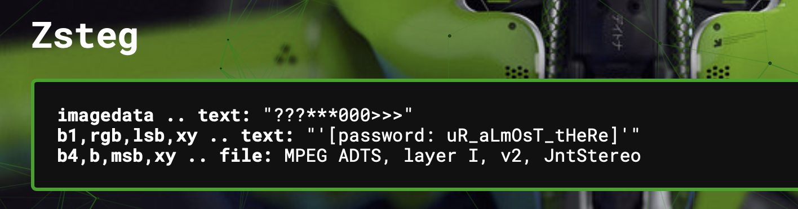
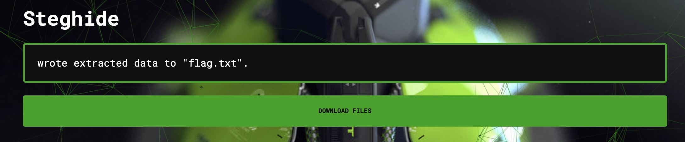

# Big JPG
> There's more data to this image than what meets the eye.

## About the Challenge
We were given a `jpg` file and we need to find the flag inside the image

## How to Solve?
First, run binwalk or you can use CyberChef and then choose `Extract File` operator. You will see a `xz` file



Open the `xz` file and you will find 2 images called `key.png` and `flag.jpg`. Input the `key.png` file into AperiSolve or you can `zsteg` tool to extract the key



You got the password! And right now you can use `steghide` or AperiSolve again but don't forget to input `uR_aLmOsT_tHeRe` in the form input



Download the result and voilà!

```
UDCTF{lay3r5_0n_lay3r5}
```