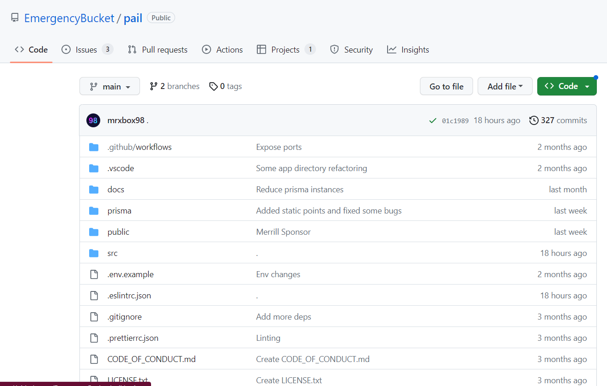
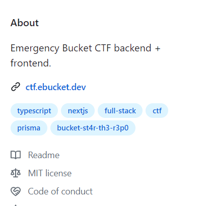

# Ping check
> Did you know that this CTF is run on custom built open source software? Note: The flag is not in the usual bucket{} format.

> Do not overthink.

> You don't need to go to any other page.

## About the Challenge
We were given a GitHub Repository and we need to find the flag there



## How to Solve?
At first i was very confused because if you need to find the flag in GitHub repository usually you need to check the commit, issue, pull request, etc. But in this case, you can see the flag in the `topics` section



```
bucket-st4r-th3-r3p0
```