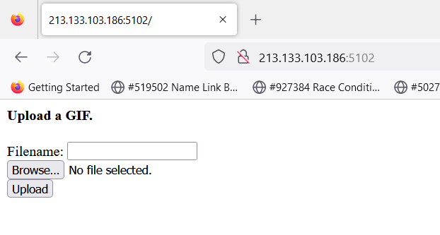
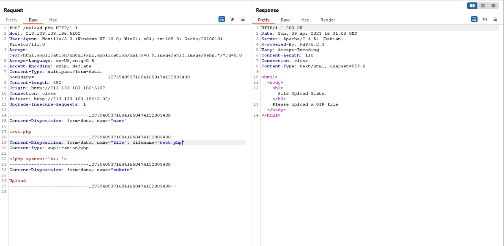
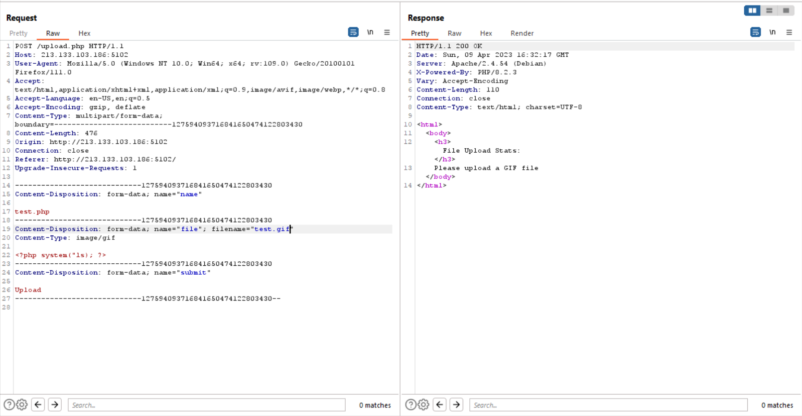
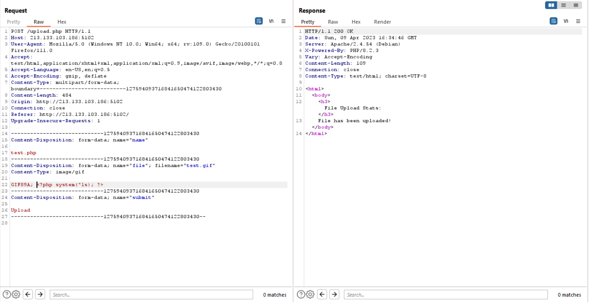

# gif
> I made a secure php web app where I can upload all my gifs. Some people on the internet told me to run it in a docker container just to protect it from my personal files, but who cares.

## About the Challenge
We were given a plain website that has the functionality to upload a GIF file.



## How to Solve?
The first thing I want to test is `Unrestricted File Upload` vulnerability where we can upload malicious file such as PHP file



At first I tried to upload a PHP file but the server wants us to upload GIF file. So I tried to change the extension file and the MIME type



The server still rejects our request. Now, I am trying to add the GIF magic header. (You can check another file's magic header [here](https://en.wikipedia.org/wiki/List_of_file_signatures))



Yay success, now access the uploaded file on `uploads` endpoint. To obtain the flag, try to upload below code into the server

```php
GIF89A; <?php system("cat /flag.txt"); ?>
```


```
bucket{1_h4t3_PHP}
```