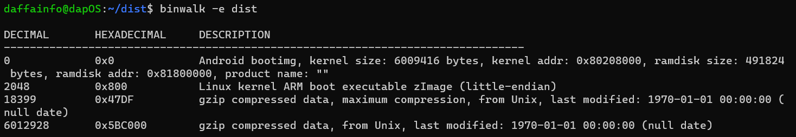
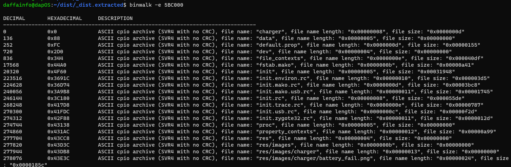
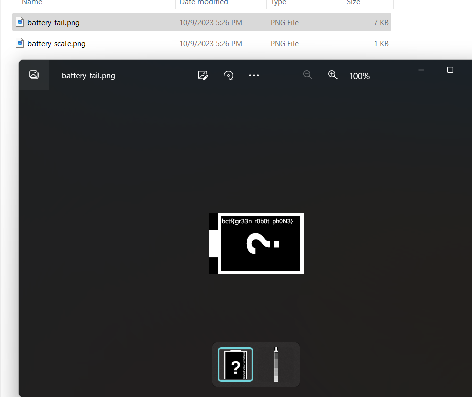

# replace-me
> I knew I shouldn't have gotten a cheap phone :/

## About the Challenge
We were given a boot image file (You can download the file [here](dist)), and we need to find the flag there

## How to Solve?
First, you can use `file` command in linux to find out the type of file to be analyzed


When I solved this challenge yesterday, I used `binwalk`, but if you are using the intended way, you can use `mkbootimg`. Now, to extract the files using `binwalk`, here is the command I used to extract the files from dist:

```bash
binwalk -e dist
```



And then extract the extracted file again called `5BC000` using binwalk

```bash
binwalk -e 5BC000
```



And the flag was located in `/cpio-root/res/images/charger` directory



```
bctf{gr33n_r0b0t_ph0N3}
```