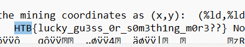

# DrillingPlatform
> Welcome to the latest and greatest in Vitralium mining technology. Our newest rig can penetrate depths never before reached! Unfortunately, we haven't yet been able to locate any. Can you get into the workings of the machine and find out where we need to drill?

## About the Challenge
We got a compiled program and we need to find there (You can download the file [here](rev_drillingplatform.zip))

## How to Solve?
Well, to solve this problem you can use notepad in Windows or `strings` in Linux



```
HTB{lucky_gu3ss_0r_s0m3thing_m0r3!!}
```