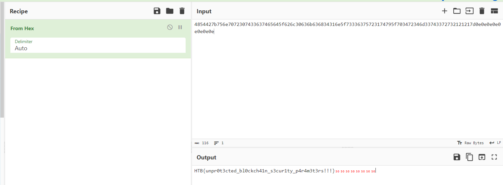

# Initialization
> During a cyber security audit of your government's infrastructure, you discover log entries showing traffic directed towards an IP address within the enemy territory of "Oumara". This alarming revelation triggers suspicion of a mole within Lusons' government. Determined to unveil the truth, you analyze the encryption scheme with the goal of breaking it and decrypting the suspicious communication. Your objective is to extract vital information and gather intelligence, ultimately protecting your nation from potential threats.

## About the Challenge
We got a zip files (You can download the file [here](crypto_initialization.zip)) that contains 3 more files (1 python script and 2 txt file). Here is the content of `source.py`

```python
#!/usr/bin/env python3

import os
from Crypto.Util import Counter
from Crypto.Util.Padding import pad
from Crypto.Cipher import AES

class AdvancedEncryption:
    def __init__(self, block_size):
        self.KEYS = self.generate_encryption_keys()
        self.CTRs = [Counter.new(block_size) for i in range(len(MSG))] # nonce reuse : avoided!

    def generate_encryption_keys(self):
        keys = [[b'\x00']*16] * len(MSG)
        for i in range(len(keys)):
            for j in range(len(keys[i])):
                keys[i][j] = os.urandom(1)
        return keys
    
    def encrypt(self, i, msg):
        key = b''.join(self.KEYS[i])
        ctr = self.CTRs[i]
        cipher = AES.new(key, AES.MODE_CTR, counter=ctr)
        return cipher.encrypt(pad(msg.encode(), 16))

def main():
    AE = AdvancedEncryption(128)
    with open('output.txt', 'w') as f:
        for i in range(len(MSG)):
            ct = AE.encrypt(i, MSG[i])
            f.write(ct.hex()+'\n')

if __name__ == '__main__':
    with open('messages.txt') as f:
        MSG = eval(f.read())
    main()
```

It looks like this python code will encrypt the msg inside `messages.txt` using AES-CTR and then save the encrypted msg in `output.txt`

## How to Solve?
At first i tried to run the program and see the behaviour. Before i ran the program, i added `print (self.KEYS)`. And here was the result


As you can see the program encrypt the key is reused for all the encryption. And because of the nonce was reused, we use this notation

```
flag = (ciphertext1 ⊕ ciphertext2) ⊕ known_plaintext
```

And i used this [reference](https://github.com/Y-CTF/writeups/tree/main/CryptoCTF2021/Wolf) to solve this chall

```python
known_plaintext = 'This is some public information that can be read out loud.'
encrypted_text = bytes.fromhex('76ca21043b5e471169ec20a55297165807ab5b30e588c9c54168b2136fc97d147892b5e39e9b1f1fd39e9f66e7dbbb9d8dffa31b597b53a648676a8d4081a20b')
encrypted_flag = bytes.fromhex('6af60a0c6e5944432af77ea30682076509ae0873e785c79e026b8c1435c566463d8eadc8cecc0c459ecf8e75e7cdfbd88cedd861771932dd224762854889aa03')

# Convert known_plaintext to bytes
known_plaintext_bytes = known_plaintext.encode()

# Perform XOR operations
result = bytes(x ^ y ^ z for x, y, z in zip(known_plaintext_bytes, encrypted_text, encrypted_flag))

# Print the result as a hexadecimal string
result_hex = result.hex()
print(result_hex)
```

After we got the result, decode the hex to obtain the flag



```
HTB{unpr0t3cted_bl0ckch41n_s3cur1ty_p4r4m3t3rs!!!}
```