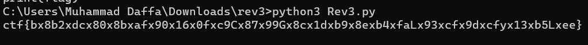

# MCV5U
> Ryzon, who just finished his ICS5U class, forgets that he also needs to finish his final MCV5U assignment, which is due on the same day!

> Unfortunately, all of Ryzon's brain cells are destroyed due to how scuffed ICS5U is, and he begs you, his friend, to help him finish this assignment for him.

> The flag format for this problem is different from the rest, it is: ctf{[!-z]{6,128}} (the part inside the bracket can be any string of 6-128 printable ASCII characters, including letters, numbers, and symbols).

## About the Challenge
We were given a zip file that contains 3 files: `Document 1.txt`, `Document 2.txt`, and `main.py`. Here is the content of `main.py`

```python
import math
import hashlib
import sys

SIZE = int(3e5)
VERIFY_KEY = "46e1b8845b40bc9d977b8932580ae44c"


def getSequence(A, B, n, m):

    ans = [0] * (n + m - 1)

    for x in range(n):
        for y in range(m):
            ans[x + y] += A[x] * B[y]

    return ans


A = [0] * SIZE
B = [0] * SIZE

document1 = open("Document 1.txt", "r")
nums1 = document1.readlines()

idx = 0

for num in nums1:
    A[idx] = int(num.strip())
    idx += 1

document2 = open("Document 2.txt", "r")
nums2 = document2.readlines()

idx = 0

for num in nums2:
    B[idx] = int(num.strip())
    idx += 1

sequence = getSequence(A, B, SIZE, SIZE)
val = 0

for num in sequence:
    val = (val + num)

val = str(val)
val_md5 = hashlib.md5(val.encode()).hexdigest()

if val_md5 != VERIFY_KEY:
    print("Wrong solution.")
    sys.exit(1)

key = str(hashlib.sha256(val.encode()).digest())
flag = "ctf{" + "".join(list([x for x in key if x.isalpha() or x.isnumeric()])) + "}"

print(flag)
```

This code calculates a sequence of numbers by performing element-wise multiplication between two lists of numbers read from `Document 1.txt` and `Document 2.txt`. It then calculates the sum of the resulting sequence, computes the MD5 hash of the sum, verifies it against a predefined key, and if it matches, generates a flag by taking the alphanumeric characters from the SHA256 hash of the sum.

The purpose of this challs is we need to recode the program using different approaches

## How to Solve?
But in my case, I decided to run the program without doing any recode. Of course to obtain the flag, I need to wait 3-4 hours XD



```
ctf{bx8b2xdcx80x8bxafx90x16x0fxc9Cx87x99Gx8cx1dxb9x8exb4xfaLx93xcfx9dxcfyx13xb5Lxee}
```