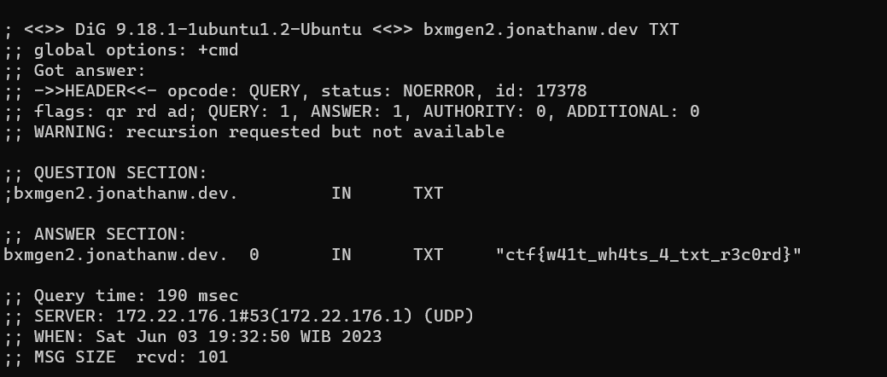

# New Website
> I made a new site at https://bxmgen2.jonathanw.dev, but my browser gave me this cryptic error code: `DNS_PROBE_FINISHED_NXDOMAIN`

## About the Challenge
As the description said, it looks like the website is broken but we need to find more information by check the website records

## How to Solve?
Check the records of the website using `dig` and the flag was located in the TXT records

```shell
dig bxmgen2.jonathanw.dev TXT
```



```
ctf{w41t_wh4ts_4_txt_r3c0rd}
```