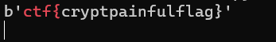

# RAID Safety Assays, But Fixed
> The flag to this challenge is all lowercase, with no underscores.
> e = 65537
> n = 4629059450272139917534568159172903078573041591191268130667
> c = 6743459147531103219359362407406880068975344190794689965016

## About the Challenge
We were given a python code and here is the content of the file

```python
from Crypto.Util.number import *
import random

p = getPrime(96)
q = getPrime(96)
n = p*q
e = 65537

flag = b'ctf{0000000000000000}'
flag = str(pow(bytes_to_long(flag), e, n))

perm = list(range(10))
random.shuffle(perm)
perm = list(map(str, perm))

c = ''.join([perm[int(x)] for x in flag])

print(f'e = {e}')
print(f'n = {n}')
print(f'c = {c}')
```

The aboce code generates two prime numbers `p` and `q`, calculates the modulus `n` for RSA encryption, encrypts a flag using the RSA encryption algorithm with the public exponent `e`, and applies a permutation cipher to the encrypted flag. The resulting encrypted flag `c` is then printed along with the values of `e` and `n`.

## How to Solve?
I created a python code to performs a brute-force search over all possible permutations of digits from 0 to 9 and I got the value of `p` and `q` using FactorDB

```python
import itertools

c = '6743459147531103219359362407406880068975344190794689965016'
e = 65537
p = 62682123970325402653307817299
q = 73849754237166590568543300233

permutations = list(itertools.permutations(range(10)))

for perm in permutations:
    perm = list(map(str, perm))

    c_list = [int(x) for x in c]

    inv_perm = [perm.index(str(i)) for i in range(10)]

    plaintext_permuted = [inv_perm[x] for x in c_list]

    c_rev = ''.join(map(str, plaintext_permuted))

    n = p*q
    phi = (p-1)*(q-1)
    d = inverse(e,phi)
    m = pow(int(c_rev),d,n)
    print(long_to_bytes(m))
```

And then run this program like this

```shell
python3 solve.py | grep "ctf"
```



```
ctf{cryptpainfulflag}
```