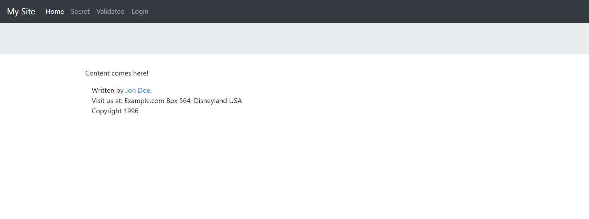
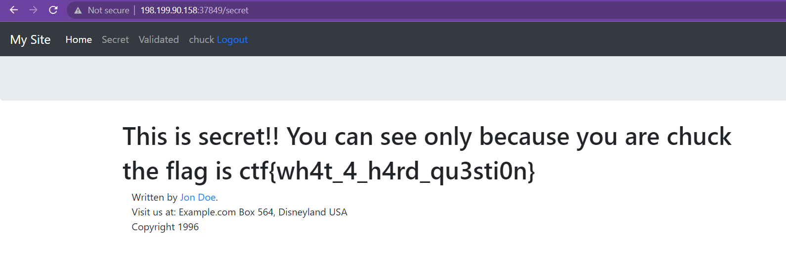

# Repository Security
> Supply chain attacks? Code leaks? Never heard of those.

> Here at Example.com, we store our entire production environment on GitHub! Our code monkeys are so talented that they would never do anything stupid that would get accounts compromised or anything like that.

## About the Challenge
We were given a source code and a website that has some functionality such as login user, secret page and in order to obtain the flag we need to login as an `admin` and access `/secret` endpoint

```
@app.route("/secret")
@login_required(username=["chuck", "mary"])
def secret():
    return render_template("secret.html")
```



## How to Solve?
As you can see in the code snippet, there is sensitive information, such as leaked admin credentials, present in the source code.

```python
from flask import Flask, jsonify, render_template
from flask.views import MethodView
from flask_simplelogin import SimpleLogin, get_username, login_required

my_users = {
    "chuck": {"password": "norris", "roles": ["admin"]},
    "lee": {"password": "douglas", "roles": []},
    "mary": {"password": "jane", "roles": []},
    "steven": {"password": "wilson", "roles": ["admin"]},
}


def check_my_users(user):
    """Check if user exists and its credentials.
    Take a look at encrypt_app.py and encrypt_cli.py
     to see how to encrypt passwords
    """
    user_data = my_users.get(user["username"])
    if not user_data:
        return False  # <--- invalid credentials
    elif user_data.get("password") == user["password"]:
        return True  # <--- user is logged in!

    return False  # <--- invalid credentials
```

Use that credential to login as administrator and go to `/secret` endpoint to obtain the flag



```
ctf{wh4t_4_h4rd_qu3sti0n}
```