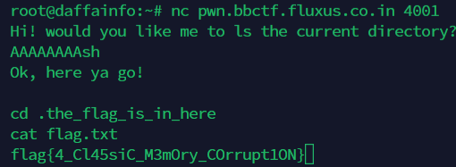

# Easy pwn
> Easy memory corruption challenge.

## About the Challenge
We are given a file (You can get the file [here](ez_pwn.zip))

## How to Solve?
Input `AAAAAAAAsh` to popup a shell, and then go to `.the_flag_is_in_here` directory and read the flag by running `cat flag.txt` command



```
flag{4_Cl45siC_M3mOry_COrrupt1ON}
```