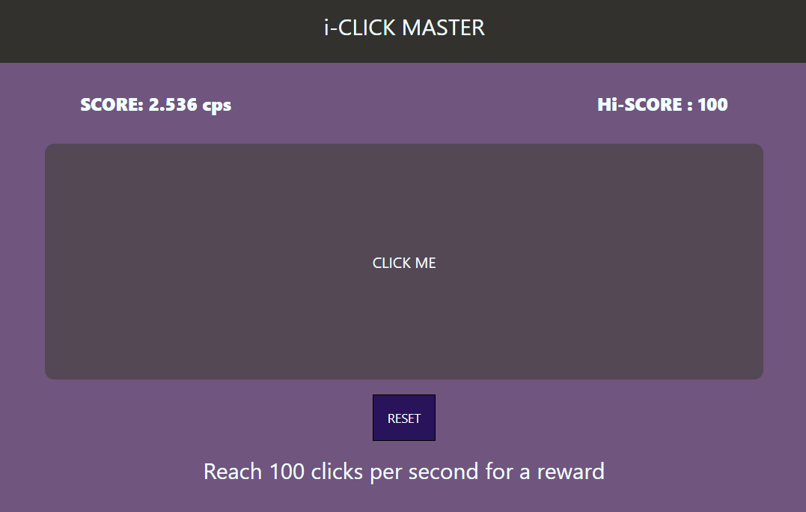

# Hi-Score
> Reach 100 clicks per second for a reward.

## About the Challenge
We are given a [web](http://chal.bbctf.fluxus.co.in:1003/) and we need to get 100 score to get the flag



## How to Solve?
First open the source code and we will get an obfuscated js file (http://chal.bbctf.fluxus.co.in:1003/static/TheScript.js). And if we deobfuscate the code using [this](https://www.dcode.fr/javascript-unobfuscator) website. We will get path of the flag `/.secretion/flag`

```
flag{THAtS_15_A_SM4rT_m0ve}
```