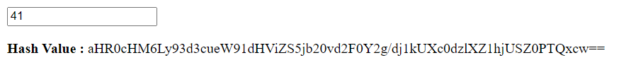

# Meaning of Life
> Senpai, what is the meaning of life ?

## About the Challenge
We are given a [web](http://misc.bbctf.fluxus.co.in:2002) where we can input some number in the form and there is a encoded base64 string. And if we decode the encoded msg we will be given a link to Rick Astley song



## How to Solve?
First we need to search the title of the chall in google and we got the number `42`. Input `42` in the form and we will get a very different encoded msg
```
Hash Value : aHR0cHM6Ly93d3cueW91dHViZS5jb20vd2F0Y2g/dj1GSVViUkprS2psRQ==
```
Decoding the msg will reveal a YouTube video with the title 'flag{}'. The song in the video is in Morse code. Use [this website](https://morsecode.world/international/decoder/audio-decoder-adaptive.html) to decode the Morse code and retrieve the flag.

```
flag{CIC4D4FLI35}
```