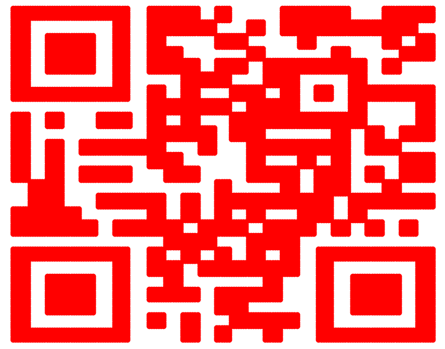

# Vastness of Space
> Is space really that empty?

## About the Challenge
We are given a picture (You can find the file [here](Empty_Space.jpg)) and we need to extract the flag from that picture

## How to Solve?
First we can use Steganographic decoder, you can use https://futureboy.us/stegano/decinput.html or https://github.com/RickdeJager/stegseek and the password is `BBCTF` (You can get the password by checking the metadata `xp_comment: The password is "BBCTF"`).

And we will get a list of number like this
```
11,8
11,9
11,10
11,11
11,12
11,13
11,14
11,15
...
```
Create a python code using matplotlib package like this
```python
import numpy as np
import matplotlib.pyplot as plt

data = np.genfromtxt("file.txt", delimiter=",")

num = data[:,0]
data = data[:,1]

plt.plot(num,data, 'ro')

plt.xlabel('x')
plt.ylabel('y')
plt.show()
```
After we run the code, the QR code will appear


And we decode the QR code using https://zxing.org/w/decode for example, we will get the flag
```
flag{qUiCk_R3sP0nse_c0d3}
```