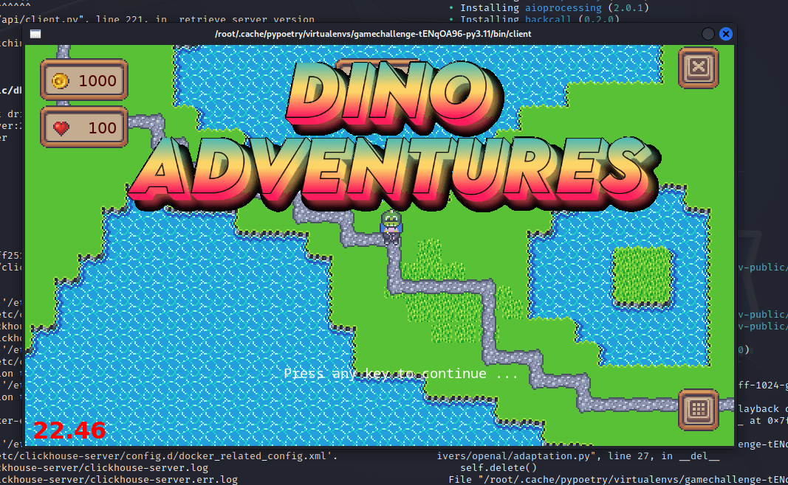
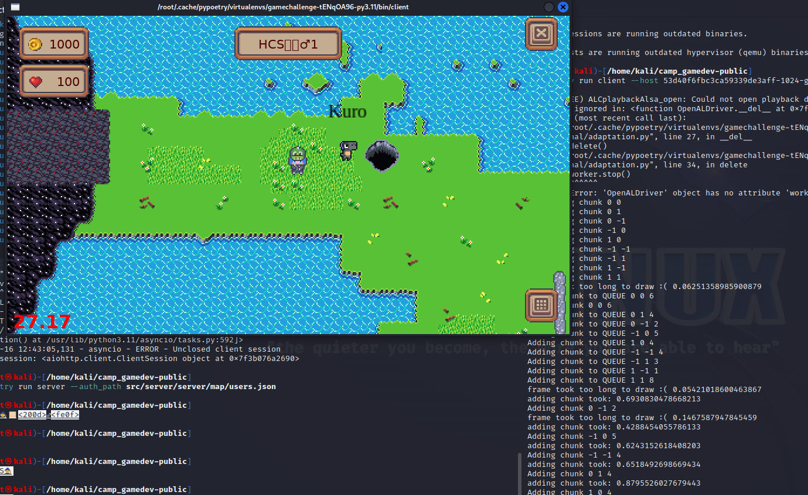
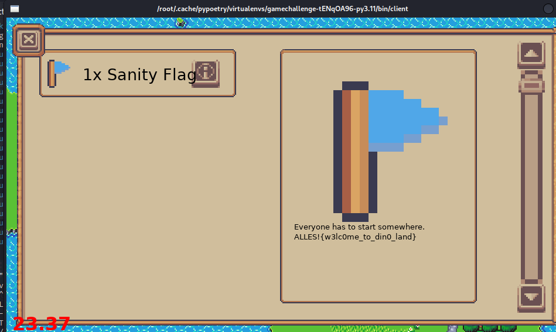

# Sanity Check
> Talk to Kuro and learn about this wonderful dino land you landed in.

## About the Challenge
We need to login to the game to obtain the falg

## How to Solve?
First, we need to login to the game by running this command

```bash
poetry run client --host 53d40f6fbc3ca59339de3aff-1024-game-server.challenge.master.camp.allesctf.net --port 31337 --ssl
```

And then you will see this main screen



And then login using our team credential and voilà



Now, talk to Kuro to obtain an item called `Sanity Flag`



```
ALLES!{w3lc0me_to_din0_land}
```