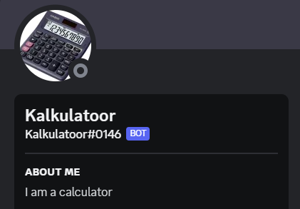
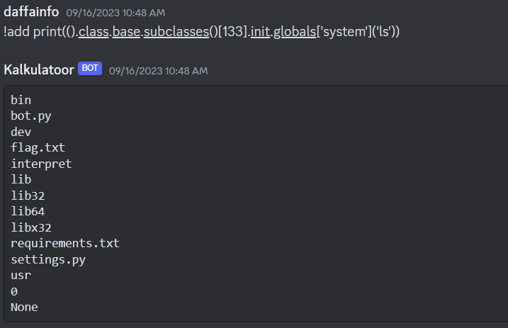

# Discord Admin Bot
> Join discord and get the flag.

> discord.gg/csaw23 discord.gg/csaw23 discord.gg/csaw23 discord.gg/csaw23 discord.gg/csaw23 discord.gg/csaw23 discord.gg/csaw23 discord.gg/csaw23 discord.gg/csaw23 discord.gg/csaw23

## About the Challenge
There is a discord bot called `Kalkulatoor`



And we got some the source code too. Here is the bot source code

```py
#############################################
# Author: Krishnan Navadia
# This is main working file for this chal
#############################################

import discord
from discord.ext import commands, tasks
import subprocess

from settings import ADMIN_ROLE
import os
from dotenv import load_dotenv
from time import time

load_dotenv()

TOKEN = os.getenv("TOKEN")

intents = discord.Intents.default()
intents.messages = True
bot = commands.Bot(command_prefix="!", intents=intents)

bot.remove_command('help')

SHELL_ESCAPE_CHARS = [":", "curl", "bash", "bin", "sh", "exec", "eval,", "|", "import", "chr", "subprocess", "pty", "popen", "read", "get_data", "echo", "builtins", "getattr"]

COOLDOWN = []

def excape_chars(strings_array, text):
    return any(string in text for string in strings_array)

def pyjail(text):
    if excape_chars(SHELL_ESCAPE_CHARS, text):
        return "No shells are allowed"

    text = f"print(eval(\"{text}\"))"
    proc = subprocess.Popen(['python3', '-c', text], stdout=subprocess.PIPE, preexec_fn=os.setsid)
    output = ""
    try:
        out, err = proc.communicate(timeout=1)
        output = out.decode().replace("\r", "")
        print(output)
        print('terminating process now')
        proc.terminate()
    except Exception as e:
        proc.kill()
        print(e)

    if output:
        return f"```{output}```"


@bot.event
async def on_ready():
    print(f'{bot.user} successfully logged in!')

@bot.command(name="flag", pass_context=True)
async def flag(ctx):
    admin_flag = any(role.name == ADMIN_ROLE for role in ctx.message.author.roles)

    if admin_flag:
        cmds = "Here are some functionalities of the bot\n\n`!add <number1> + <number2>`\n`!sub <number1> - <number2>`"
        await ctx.send(cmds)
    else:
        message = "Only 'admin' can see the flag.😇"
        await ctx.send(message)

@bot.command(name="add", pass_context=True)
async def add(ctx, *args):
    admin_flag = any(role.name == ADMIN_ROLE for role in ctx.message.author.roles)
    if admin_flag:
        arg = " ".join(list(args))
        user_id = ctx.message.author.id
        ans = pyjail(arg)
        if ans: await ctx.send(ans)
    else:
        await ctx.send("no flag for you, you are cheating.😔")

@bot.command(name="sub", pass_context=True)
async def sub(ctx, *args):
    admin_flag = any(role.name == ADMIN_ROLE for role in ctx.message.author.roles)
    if admin_flag:
        arg = " ".join(list(args))
        ans = pyjail(arg)
        if ans: await ctx.send(ans)
    else:
        await ctx.send("no flag for you, you are cheating.😔")


@bot.command(name="help", pass_context=True)
async def help(ctx, *args):
    await ctx.send("Try getting `!flag` buddy... Try getting flag.😉")


@bot.event
async def on_command_error(ctx, error):
    if isinstance(error, commands.CommandNotFound):
        await ctx.send("Try getting `!flag` buddy... Try getting flag.😉")
    else:
        print(f'Error: {error}')


bot.run(TOKEN)
```

This is a Pyjail challenge, but we need to have an admin role to execute python commands

## How to Solve?
First, we need to invite the bot on our discord server by using accessing this URL

https://discord.com/oauth2/authorize?client_id=1151613133027295232&permissions=8&scope=bot

Hmmm, how do you know if the bot id was `1151613133027295232`? You can use developer mode and then right click the bot profile and press `Copy User ID` button


To use the bot, we also need to create a custom discord role called `admin` and assign it to our account. And then we can use command `!add` or `!sub` to execute some python command

```py
@bot.command(name="add", pass_context=True)
async def add(ctx, *args):
    admin_flag = any(role.name == ADMIN_ROLE for role in ctx.message.author.roles)
    if admin_flag:
        arg = " ".join(list(args))
        user_id = ctx.message.author.id
        ans = pyjail(arg)
        if ans: await ctx.send(ans)
    else:
        await ctx.send("no flag for you, you are cheating.😔")

@bot.command(name="sub", pass_context=True)
async def sub(ctx, *args):
    admin_flag = any(role.name == ADMIN_ROLE for role in ctx.message.author.roles)
    if admin_flag:
        arg = " ".join(list(args))
        ans = pyjail(arg)
        if ans: await ctx.send(ans)
    else:
        await ctx.send("no flag for you, you are cheating.😔")
```

Because there is a list of blacklisted characters, we can still bypass it by running this command

```
!add print(().__class__.__base__.__subclasses__()[133].__init__.__globals__['system']('ls'))
```



And then read the flag by running `cat flag.txt` command


```
csawctf{Y0u_4r3_th3_fl4g_t0_my_pyj4il_ch4ll3ng3}
```