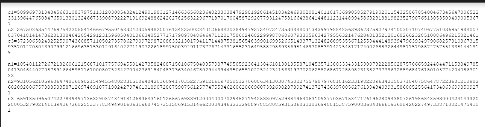
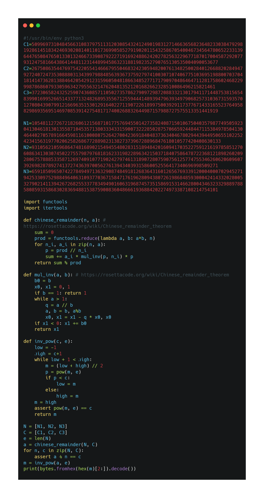
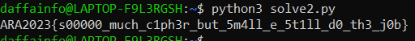

# Babychall
> Welcome to ARACTF! To start the CTF, please translate this flag that I get from display banner! Good Morning

## About the Challenge
Given a file containing sets n1 n2 n3, and c1 c2 c3 (You can get the file [here](pairs_of_numbers.txt))



## How to Solve?
To solve this problem, we can use the Chinese Remainder Theorem (CRT). Here I use this [reference](https://github.com/GiVeMeRoOt/CTFWRITEUPS/blob/master/RSA1/rsa.py)





```
ARA2023{s00000_much_c1ph3r_but_5m4ll_e_5t1ll_d0_th3_j0b}
```