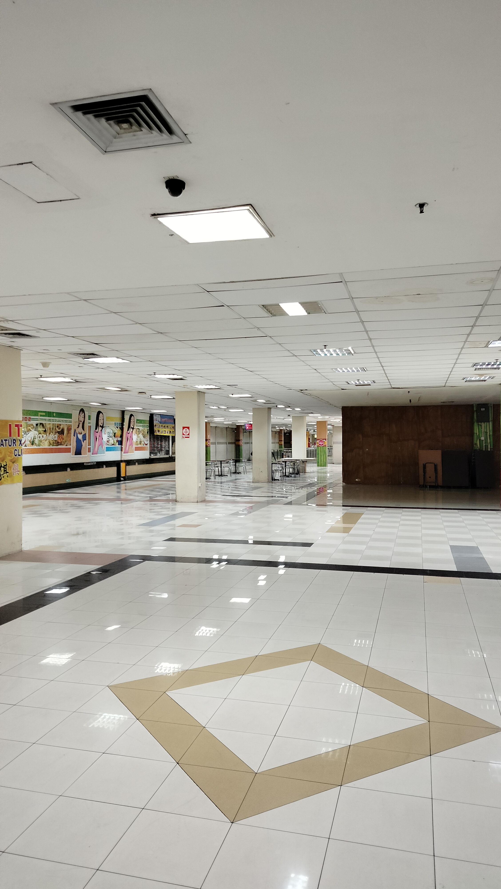
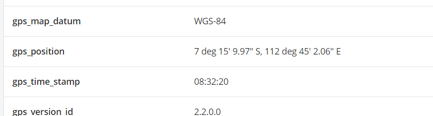
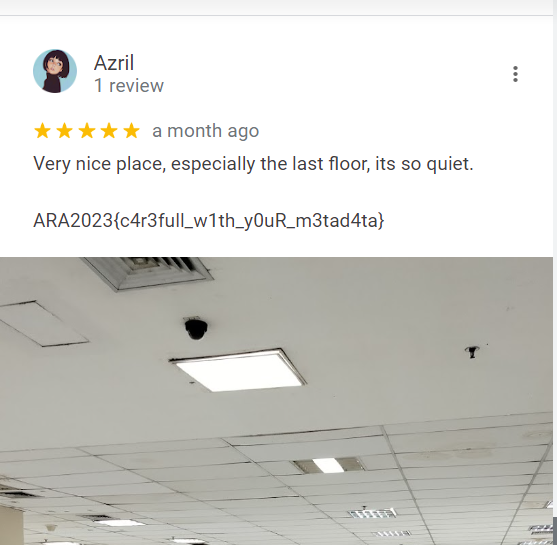

# Backroom
> I found a place that give me a backroom vibes. I think I like this place, so I give this place 5 star. Can you find this place?

## About the Challenge
Given a photo and we have to find the name of this place where the photo was taken.



## How to Solve?
To solve this problem, the first thing is to look at the file metadata first



There is a latitude and longitude where the photo was taken, if you go to Google maps it will be directed to the `Hi Tech Mall` location in `Surabaya`. And then if you look at the review of the place, you will found the flag



```
ARA2023{c4r3full_w1th_y0uR_m3tad4ta}
```