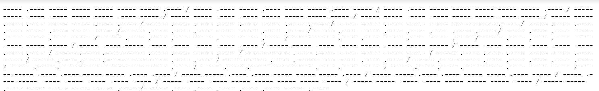
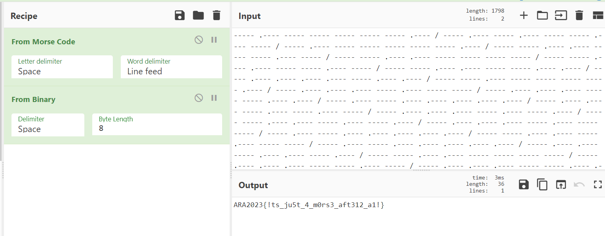

# D0ts N D4sh3s
> Albert was lost in a deep forest surrounded by a sea and tried to escape by sending a SOS signal containing a code.

> Jack who works at a lighthouse realized that someone was sending a SOS signal and responses as fast as he can.

> What do you think Albert tries to say?

## About the Challenge
A google drive link is given which, if opened, will be directed to a file called `The Morse.txt` and the file contains Morse code. (You can get the file [here](The%20Morse.txt))



## How to Solve?
To solve this chall, use the `Morse Code Translator` and then continue by changing binary to ASCII, so we will get a flag



```
ARA2023{!ts_ju5t_4_m0rs3_aft312_a1!}
```